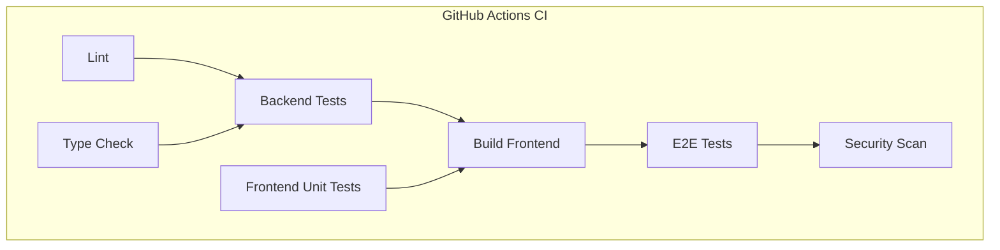

# Job Raider Comprehensive Testing Strategy

## Executive Summary

This document describes the current testing setup for the Job Raider project. It covers the backend pytest suite, the Next.js Vitest unit tests, Playwright end-to-end tests, and the CI/CD pipeline that runs them.

## Current State

### Backend (`apps/backend-py`)

- **Framework**: pytest with pytest-asyncio, pytest-mock, and pytest-cov
- **Test count**: ~504 passing unit and integration tests
- **Coverage**: Reported in CI via `pytest --cov=src --cov-report=xml`
- **Key areas**: API routes, pipeline orchestration, resume generation, scoring, RAG, LinkedIn analysis, settings, applications, vector store, utility modules
- **Run command**: `cd apps/backend-py && .venv/bin/python -m pytest tests/ -v`

### Frontend (`apps/frontend-ts`)

- **Unit framework**: Vitest with React Testing Library and MSW
- **E2E framework**: Playwright
- **Test count**: 51 unit tests across 10 test files; 10 E2E specs
- **Run commands**:
  - Unit: `cd apps/frontend-ts && npm run test -- --run`
  - E2E: `cd apps/frontend-ts && npm run test:e2e`

### CI/CD

GitHub Actions run on every push and pull request to `main` and `develop`:

1. Secret scan (gitleaks)
2. Python lint (`black`, `ruff`)
3. Python type check (`mypy`, non-blocking)
4. Backend tests with coverage upload to Codecov
5. Next.js lint, type check, unit tests, format check, build, and E2E tests
6. Security scan (bandit, safety, non-blocking)
7. Docker image build and push on tags / manual dispatch



## Testing Approach

### Unit Tests

Unit tests live next to production code under `apps/backend-py/tests/` and `apps/frontend-ts/tests/`. They exercise individual functions, components, and API routes in isolation with mocked dependencies.

### Integration Tests

Backend integration tests verify API route behavior using FastAPI's `TestClient` with module-level state patched (e.g., `stored_profiles`, `active_profile_id`). External services are mocked.

### End-to-End Tests

Playwright tests run against a built Next.js application and exercise complete user flows through the browser.

## Running Tests Locally

```bash
# All backend tests
cd apps/backend-py
.venv/bin/python -m pytest tests/ -v

# A single test file
.venv/bin/python -m pytest tests/unit/test_pipeline_routes.py -v

# Frontend unit tests
cd apps/frontend-ts
npm run test -- --run

# Frontend E2E tests
cd apps/frontend-ts
npm run test:e2e

# Full local quality gate from project root
make lint
make test
make type-check
```

## Coverage

Coverage reports are generated during CI and uploaded to Codecov. Local coverage can be generated with:

```bash
cd apps/backend-py
.venv/bin/python -m pytest tests/ --cov=src --cov-report=html
```

## Known Gaps and Next Steps

- The legacy Streamlit frontend (`frontend-py/`) is superseded by `apps/frontend-ts` and is not covered by CI.
- Profile/session state is currently in-process; tests that rely on active profile state are patched at the module level.
- Some external service integrations (LinkedIn scraping, actual LLM calls) are mocked in tests and verified manually.

## Related Documentation

- [Testing Guide](docs/testing.md)
- [Manual Verification Checklist](docs/manual-verification-checklist.md)
- [CI/CD Workflow](.github/workflows/ci.yml)
