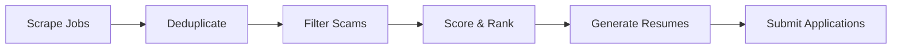

# Job Raider

Automated job application pipeline that aggregates listings from multiple platforms, scores relevance, generates tailored resumes, and automates submissions.

## Features

- **Multi-Platform Job Aggregation**: LinkedIn (Playwright) + JSearch API (50+ boards via Google for Jobs)
- **Smart Filtering**: Keyword matching, scam detection (10 indicators), profile-based filtering
- **Relevance Scoring**: 100-point heuristic scoring with configurable thresholds
- **Semantic Matching**: RAG-powered similarity search using ChromaDB vector store and embeddings
- **Resume Generation**: Two-model approach (small for selection, large for writing)
- **Resume Analysis**: AI-powered general and job-specific gap analysis with scoring
- **Auto-Submit Detection**: Identifies "Easy Apply" opportunities
- **Dry Run Mode**: Test everything without actual submissions
- **Cost Optimization**: 80% cost reduction using local Ollama models
- **Application Tracking**: Track applications from submission to offer with custom statuses

## Architecture



### Two-Model Approach

1. **Small Model (qwen2.5:3b)** - Selects relevant projects and keywords
2. **Large Model (qwen2.5:7b)** - Writes tailored resumes

This reduces API costs by 80% while maintaining quality.

## Quick Start

### Prerequisites

- Python 3.11+
- 8GB VRAM (for local models)
- Ollama installed

### Installation

```bash
# Clone repository
git clone https://github.com/yourusername/job-raider.git
cd job-raider

# Run setup
./setup.sh

# Pull Ollama models
ollama pull qwen2.5:3b
ollama pull qwen2.5:7b
ollama pull nomic-embed-text

# Configure environment
cp backend-py/.env.example backend-py/.env
# Edit backend-py/.env with your API keys
```

### Usage

#### Interactive Mode

```bash
cd backend-py
python main.py --interactive
```

#### CLI Mode

```bash
# Basic search with dry run
cd backend-py
python main.py \
  --resume my_resume.pdf \
  --keywords "python engineer" \
  --locations "remote" \
  --dry-run

# Full pipeline with submission
cd backend-py
python main.py \
  --resume my_resume.pdf \
  --keywords "fintech AI" \
  --locations "remote" \
  --no-dry-run
```

## Pipeline Stages

| Stage | Description | Output |
|-------|-------------|--------|
| 1. Scrape | Aggregate from LinkedIn and JSearch API (50+ boards) | Raw listings |
| 2. Deduplicate | Remove duplicates across sources | Unique listings |
| 3. Filter Scams | Filter out potential scams | Legitimate listings |
| 4. Filter by Profile | Match user preferences | Relevant listings |
| 5. Score & Rank | Heuristic relevance scoring (0-100) | Ranked listings |
| 6. Semantic Re-Rank | RAG-based similarity scoring with ChromaDB embeddings | Re-ranked listings |
| 7. Detect Auto-Submit | Identify "Easy Apply" opportunities | Submission info |
| 8. Present Selection | Show ranked list to user | Selected jobs |
| 9. Generate Resumes | Create tailored resumes (5 templates, ATS mode) | PDF/DOCX files |
| 10. Submit | Auto-submit where possible | Application tracking |

## Scoring Heuristic

| Category | Points | Description |
|----------|--------|-------------|
| Keywords | 30 | Keyword overlap with targets |
| Skills | 40 | Skills match against profile |
| Experience | 20 | Experience level alignment |
| Location | 10 | Location preference match |
| **Total** | **100** | **Threshold: 60 to apply** |

## Scam Detection

10 scam indicators:
- Payment required
- Personal email domains
- Messaging app only contact
- Unrealistic salary
- Fake company names
- Vague descriptions
- Poor grammar
- Immediate hire language
- Suspicious titles
- Phishing links

## Project Structure

```
job-raider/                      # Project root (monorepo)
├── backend-py/                  # Python backend
│   ├── .venv/                   # Python virtual environment
│   ├── config/                  # Configuration files
│   │   ├── model_config.yaml
│   │   ├── prompt_templates.yaml
│   │   ├── scoring_config.yaml
│   │   └── logging_config.yaml
│   ├── src/                     # Source code
│   │   ├── agents/             # Multi-agent system (coordinator, communication bus, career coach)
│   │   ├── api/                # FastAPI REST API (routes, models, websocket)
│   │   ├── assessment/         # Technical assessment trainer + DISC engine
│   │   ├── classifiers/        # LLM-based job classification
│   │   ├── config/             # YAML config loader
│   │   ├── llm/                # LLM clients (Claude, Ollama, router)
│   │   ├── linkedin/           # LinkedIn Easy Apply automation
│   │   ├── models/             # Pydantic V2 data models
│   │   ├── scrapers/           # Job scraping (LinkedIn, JSearch API)
│   │   ├── extractors/         # Resume and JD parsing (pypdf)
│   │   ├── scoring/            # Filtering, matching, scam detection, trust analysis
│   │   ├── rag/                # RAG pipeline (embeddings, vector store, ranker, chunker)
│   │   ├── generation/         # Resume generation (selector, writer, formatter with 5 templates)
│   │   ├── submission/         # Application submission and detection
│   │   ├── pipeline/           # Pipeline orchestration and stages
│   │   ├── health/             # System health checks (including MLflow)
│   │   ├── metrics/            # Cost tracking, outcome tracking, MLflow integration
│   │   ├── reports/            # HTML report generation
│   │   ├── experiments/        # A/B testing framework
│   │   └── utils/              # Caching, logging, Sentry, utilities
│   ├── tests/                   # Unit and integration tests
│   ├── notebooks/               # Jupyter notebooks
│   ├── main.py                  # CLI entry point
│   └── requirements.txt         # Python dependencies
├── frontend-ts/                 # Next.js + Tailwind dashboard (active frontend)
│   ├── src/
│   │   ├── app/                # Next.js App Router pages (9 pages)
│   │   ├── components/         # Shared UI components + layout
│   │   └── lib/                # API client, types, utilities
│   ├── tests/                   # Vitest unit + Playwright E2E tests
│   ├── Dockerfile               # Multi-stage production build (standalone)
│   └── package.json             # Node dependencies
├── frontend-py/                 # Legacy Streamlit dashboard (superseded by frontend-ts; still tested in CI)
├── data/                        # Shared data storage
│   ├── listings/                # Scraped listings
│   ├── profiles/                # User profile data
│   ├── cache/                   # LLM response cache
│   └── results/                 # Pipeline results and generated resumes
├── docker/                      # Backend Dockerfiles
│   ├── Dockerfile               # Production (CUDA + GPU)
│   └── Dockerfile.dev           # Development (slim)
├── docs/                        # Documentation
│   ├── index.md                # Documentation hub
│   ├── architecture.md         # System architecture and data flow
│   ├── usage.md                # Installation and usage guide
│   ├── api.md                  # API reference
│   ├── troubleshooting.md      # Common issues and solutions
│   └── disk-space.md           # Disk space management
├── scripts/                     # Shell/utility scripts
│   ├── find-port.sh            # Dynamic port discovery
│   └── cleanup.sh              # Temporary file cleanup
├── tasks/                       # Project tracking (todo.md, lessons.md)
├── docker-compose.yml           # Multi-service orchestration
├── docker/Dockerfile            # Backend container definition (production)
├── docker/Dockerfile.dev        # Backend container definition (development)
├── docker-run.sh                # Docker startup with port detection
├── setup.sh                     # One-command setup script
├── dev.sh                       # Local development with hot reload
├── Makefile                     # Common development commands
└── README.md                    # This file
```

## Documentation

- **[Documentation Index](docs/index.md)** - Documentation hub and quick links
- **[Architecture](docs/architecture.md)** - System architecture and design
- **[Usage Guide](docs/usage.md)** - Installation and usage
- **[API Reference](docs/api.md)** - Complete API documentation
- **[Troubleshooting](docs/troubleshooting.md)** - Common issues and solutions
- **[Disk Space Management](docs/disk-space.md)** - Data retention policies

## Configuration

Job Raider uses a two-tier configuration system:

### Credentials (.env)

API keys and secrets live in `backend-py/.env` (copy from `backend-py/.env.example`).

```bash
# Required for API fallback
ANTHROPIC_API_KEY=your_key_here

# Required for JSearch API (job aggregation from 50+ boards)
RAPIDAPI_KEY=your_rapidapi_key_here

# Optional: Kaggle API (for scam detector evaluation notebook)
KAGGLE_USERNAME=your_username
KAGGLE_KEY=your_key

# Optional: Scraping credentials (for Easy Apply)
LINKEDIN_EMAIL=your_email
LINKEDIN_PASSWORD=your_password

# Optional: Sentry error tracking
SENTRY_DSN=your_sentry_dsn_here

# Optional: MLflow experiment tracking (shared service)
MLFLOW_TRACKING_URI=http://localhost:5000
```

### Application Settings (config/*.yaml)

All non-sensitive configuration lives in YAML files under `backend-py/config/`:

| Config File | Purpose |
|-------------|---------|
| `app_config.yaml` | General settings (paths, development flags, monitoring) |
| `model_config.yaml` | LLM model selection, routing, caching, rate limits |
| `scoring_config.yaml` | Scoring weights, thresholds, skill categories |
| `scrapers_config.yaml` | Scraper settings, rate limiting, browser automation |
| `search_config.yaml` | Default keywords, locations, filters |
| `logging_config.yaml` | Logging levels and output configuration |
| `prompt_templates.yaml` | LLM prompt templates |

Example: Edit `backend-py/config/search_config.yaml` to change default search keywords:

```yaml
keywords:
  - "python"
  - "software engineer"
  - "backend"
  - "remote"
```

## System Requirements

### Minimum

- Python 3.11+
- 16GB RAM
- 8GB VRAM
- Ollama installed

### Recommended

- NVIDIA GPU (RTX 3070 Ti or better)
- 32GB RAM
- SSD storage

## Development

### Web Dashboard (Next.js)

The web dashboard (`frontend-ts/`) is a Next.js + Tailwind CSS application that provides a visual interface for the full pipeline. It is the active frontend; the legacy Streamlit dashboard in `frontend-py/` is retained but superseded.

```bash
# Start backend API first (http://localhost:8000)
make dev-api

# In another terminal, start the Next.js dashboard (http://localhost:3000)
make dev-frontend

# Or start both together
make dev
```

Or use Docker to start all services at once:

```bash
bash docker-run.sh
```

The dashboard includes nine pages: Dashboard (overview), Pipeline (run/monitor), Jobs (search/browse), Profile (resume upload), Resume Analysis (AI scoring), Assessment (technical trainer + DISC), Applications (tracker), Metrics (costs/outcomes), and Settings (configuration).

### Running Tests

Run `pytest` from either backend or frontend to see current counts.

```bash
# Backend tests
cd backend-py
source .venv/bin/activate
pytest

# Frontend tests (Next.js — Vitest unit + Playwright E2E)
cd frontend-ts
npm test

# Or use make from project root
make test
```

### Code Style

```bash
# From project root
make format      # Format code
make lint        # Run linting

# Or manually
cd backend-py
black src/
pylint src/
mypy src/
```

## Contributing

Contributions welcome! Please:

1. Read the [architecture documentation](docs/architecture.md)
2. Follow code style guidelines
3. Add tests for new features
4. Update documentation

## License

MIT License - See LICENSE file for details
