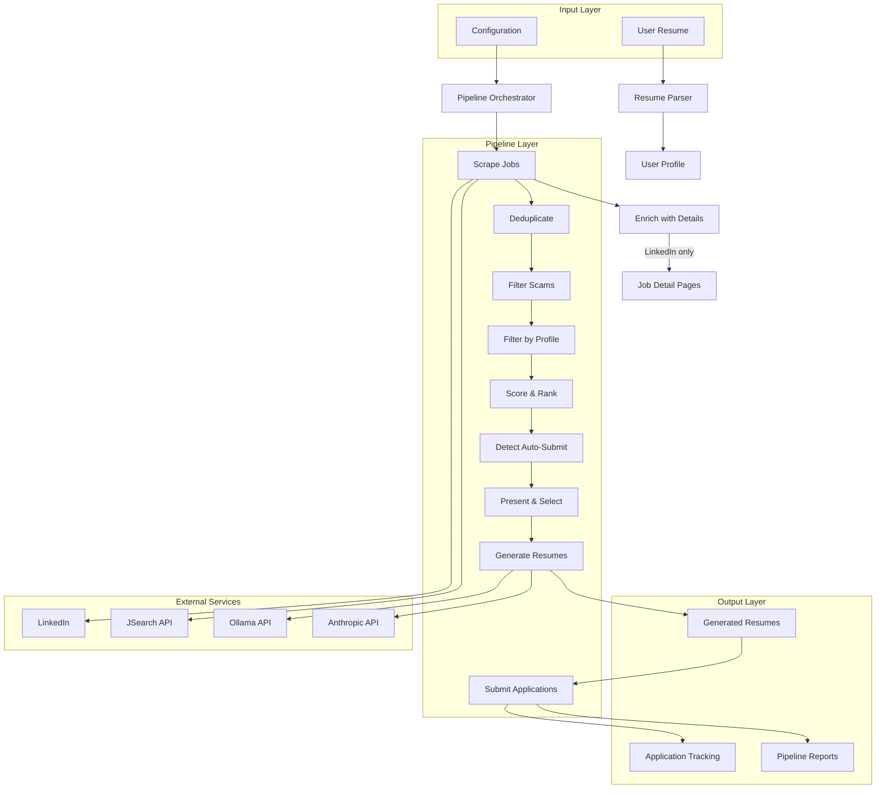
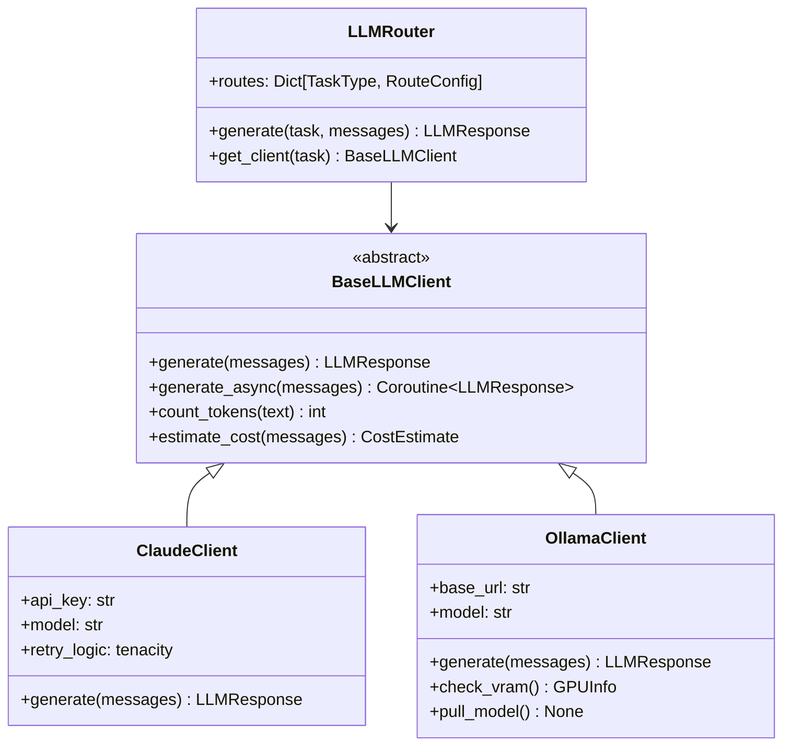
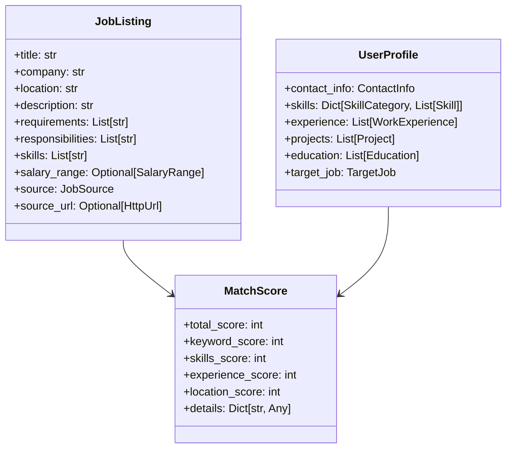
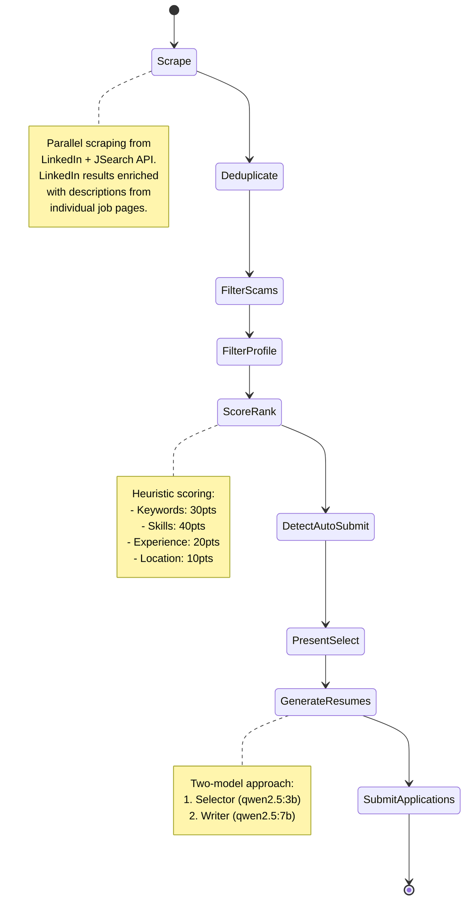
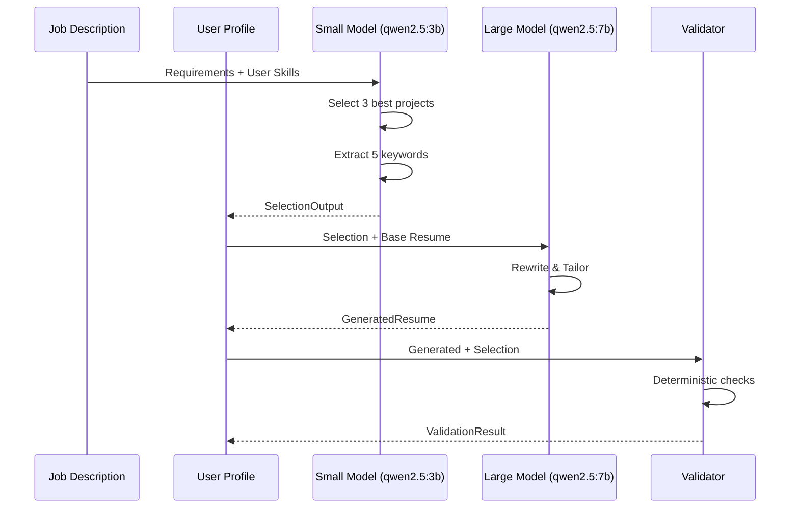
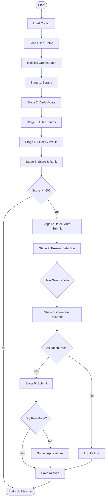
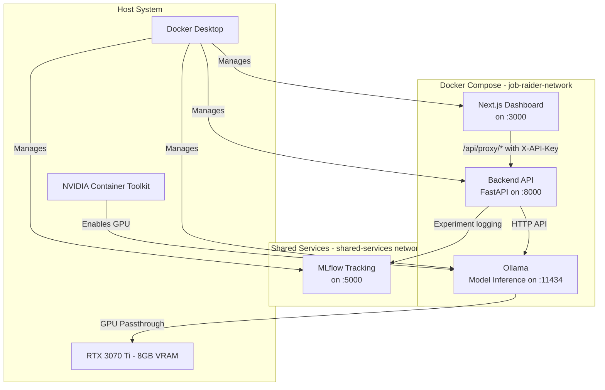

# Job Raider - Architecture Documentation

## Overview

Job Raider is an automated job application pipeline that aggregates job listings from multiple platforms, scores relevance, generates tailored resumes, and automates submissions where possible.

## System Architecture



## Component Architecture

### 1. LLM Layer



### 2. Data Models



### 3. Pipeline Stages



## Two-Model Architecture

### Resume Generation Strategy

Job Raider uses a two-model approach to optimize cost and quality:



**Benefits:**
- **Cost Reduction:** 80% of calls use free local model
- **Quality:** Large model ensures high-quality writing
- **Context Control:** Small model extracts signal, reduces hallucination
- **Validation:** Deterministic checks prevent fabrication

### Model Selection for 8GB VRAM

| Model | Parameters | VRAM Usage | Use Case | Cost |
|-------|-----------|------------|----------|------|
| qwen2.5:3b | 3B | ~2 GB | Selection, Scoring | Free (local) |
| qwen2.5:7b | 7B | ~4 GB | Resume Writing | Free (local) |
| gemma3:4b | 4B | ~2.5 GB | Alt. Selection | Free (local) |
| gemma3:12b | 12B | ~7 GB | Alt. Writing | Free (local) |
| claude-sonnet-4-6 | N/A | N/A | Fallback/API | ~$3/50 apps |

## Data Flow

### Pipeline Execution Flow



### Storage Architecture

```
data/
├── listings/              # Scraped job listings
│   ├── 20260421_120000.json
│   └── 20260421_130000.json
├── applications/          # Application tracking
│   ├── {app_id}.json
│   └── ...
├── cache/                # LLM response cache
│   └── responses.json
└── results/              # Pipeline results
    ├── resumes/          # Generated resumes
    │   ├── {job_id}.pdf
    │   └── {job_id}.docx
    ├── applications/     # Application data
    │   └── {app_id}.json
    └── pipeline_run_*.json
```

## Scoring Heuristic

The relevance scoring algorithm uses a 100-point scale:

| Category | Points | Calculation |
|----------|--------|-------------|
| Keyword Match | 30 | (matched_keywords / target_keywords) × 30 |
| Skills Match | 40 | (matched_skills / total_skills) × 40 |
| Experience Level | 20 | Exact match: 20, Adjacent: 10, Mismatch: 0 |
| Location Preference | 10 | Exact match: 10, Same region: 5, Remote: 3 |

**Threshold:** 60+ points = worth applying

## Scam Detection

Job Raider includes 10 scam indicators:

1. **Payment Required** - Requests payment to work
2. **Personal Email** - Uses Gmail/Yahoo instead of company domain
3. **Messaging App Only** - Contact only via Telegram/WhatsApp
4. **Unrealistic Salary** - Hourly rates > $100 or too high for role
5. **Fake Company** - Suspicious company names (Confidential, Hidden)
6. **Vague Description** - Missing or too short description
7. **Poor Grammar** - Multiple grammar issues
8. **Immediate Hire** - "Start today", "no interview"
9. **Suspicious Title** - Unrealistic earnings claims
10. **Phishing Links** - Suspicious external URLs

**Scoring:** Each indicator adds 10-50 points. Threshold 70 = scam.

## Auto-Submit Detection

The system detects three types of application methods:

| Method | Description | Action |
|--------|-------------|--------|
| Easy Apply | Platform native quick apply | Auto-submit (dry-run first) |
| External Site | Redirects to company ATS | Flag for manual application |
| Manual | Requires custom process | Flag for manual application |

## Frontend Architecture

The web dashboard is built with Next.js 16 (App Router) + Tailwind CSS + shadcn/ui.

```mermaid
graph LR
    subgraph "Browser"
        Pages[8 App Router Pages]
        Components[Layout + UI Components]
    end

    subgraph "Next.js Server"
        Proxy[/api/proxy/path Route Handler]
    end

    subgraph "FastAPI Backend"
        Routes[API Routes]
        Auth[verify_api_key Dependency]
    end

    Pages -->|fetch /api/proxy/*| Proxy
    Proxy -->|X-API-Key header + forward| Auth
    Auth --> Routes
```

### Key Design Decisions

- **Server-side proxy:** All backend calls go through `/api/proxy/[...path]` — a Next.js Route Handler that injects `X-API-Key` from a server-only env var. The API key is never exposed to the browser.
- **TanStack Query:** All data fetching uses `useQuery` / `useMutation` with automatic caching and refetch.
- **App state context:** Cross-page state (selected job, active pipeline run, saved jobs) lives in a React context populated at the root layout.
- **Error boundary + Suspense:** Every page is wrapped in an `ErrorBoundary` and `<Suspense fallback={<PageSkeleton />}>` in the AppShell.
- **Mobile nav:** Sidebar hidden below `md` breakpoint; a Sheet drawer with hamburger toggle shown instead.

### Pages

| Route | Purpose |
|-------|---------|
| `/dashboard` | Health checks, quick stats, recent pipeline runs |
| `/pipeline` | Start form, WebSocket live monitor, history |
| `/jobs` | Search, split-panel list + detail, pagination, save/apply |
| `/applications` | Tracker: All / Saved / Hidden tabs, track external |
| `/profile` | Resume upload (dropzone), parsed profile display |
| `/resume-analysis` | Upload + optional JD → AI score, gaps, recommendations |
| `/metrics` | Recharts funnel + pie, cost tiles, LLM call log |
| `/settings` | Model params, API config, cost limits, validate/reset |

## Security Considerations

1. **API Keys:** Backend key in `backend-py/.env`, frontend key in `frontend-ts/.env.local` — neither committed
2. **X-API-Key auth:** All FastAPI routes protected by `verify_api_key` dependency; bypassed only when `API_KEY` env var is unset (local dev)
3. **Server-only proxy:** `BACKEND_API_URL` and `API_KEY` are server env vars — never bundled into client JS
4. **Dry Run Mode:** Default for all submissions
5. **Rate Limiting:** 2 sec delay, 30 per hour max
6. **Data Privacy:** Local processing, resume data never leaves system
7. **Scam Protection:** Multi-layer scam detection before processing

## Deployment Architecture

### Docker Service Topology



### Container Configuration

| Service | Image | Port | GPU | Purpose |
|---------|-------|------|-----|---------|
| backend | Custom (CUDA 12.4.0) | Dynamic (default 8000) | No | FastAPI REST API, pipeline orchestration |
| ollama | ollama/ollama:latest | Dynamic (default 11434) | Yes (NVIDIA) | Local LLM inference (qwen2.5:3b, qwen2.5:7b) |
| frontend | Custom (Node 20 Alpine) | Dynamic (default 3000) | No | Next.js web dashboard |
| mlflow | ghcr.io/mlflow/mlflow:latest | 5000 | No | Shared experiment tracking (see docs/mlflow-setup.md) |

### GPU Passthrough

GPU acceleration is configured via the NVIDIA Container Toolkit:

- The Ollama container receives GPU access through Docker's `deploy.resources.reservations.devices` configuration
- CUDA 12.4.0 runtime is used in the backend container for compatibility with the host driver (595.79, CUDA 13.2)
- Ollama automatically detects and uses CUDA for model inference when GPU is available
- Models (qwen2.5:3b, qwen2.5:7b) are stored in a persistent Docker volume (`ollama-data`) and pulled on first use

### Dynamic Port Allocation

Ports are allocated dynamically to avoid conflicts with other services:

- `docker-run.sh` calls `scripts/find-port.sh` to discover available ports starting from the default
- Port assignments are passed to docker-compose via environment variables (`BACKEND_PORT`, `OLLAMA_PORT`, `FRONTEND_PORT`)
- The docker-compose.yml uses the extended port definition format with `${VAR:-default}` interpolation

### Inter-Service Communication

- Frontend to Backend: Next.js proxy at `/api/proxy/*` forwards to `http://backend:8000` (Docker) or `http://localhost:8000` (local)
- Backend to Ollama: HTTP API calls via Docker internal DNS (`http://ollama:11434`)
- All services share the `job-raider-network` bridge network
