# Job Raider - Architecture Documentation

## Overview

Job Raider is an automated job application pipeline that aggregates job listings from multiple platforms, scores relevance, generates tailored resumes, and automates submissions where possible.

## Tech Stack

The following table lists the core technologies that make up Job Raider, the minimum version used in the project, and the role each one plays. Versions are pinned in `apps/backend-py/requirements.txt` and `apps/frontend-ts/package.json`.

| Category | Component | Version | Purpose |
|----------|-----------|---------|---------|
| **Backend Runtime** | Python | 3.11+ | Core language and async runtime |
| | FastAPI | 0.115+ | Async web framework for REST and WebSocket endpoints |
| | Uvicorn | 0.30+ | ASGI server with WebSocket support |
| | Pydantic | 2.5+ | Request/response validation and settings management |
| **Data Layer** | SQLAlchemy | 2.0+ | Async ORM for PostgreSQL |
| | Alembic | 1.13+ | Database schema migrations |
| | asyncpg | 0.29+ | Async PostgreSQL driver |
| | Supabase | 2.4+ | Storage bucket operations |
| | pgvector | 0.2+ | SQLAlchemy types for vector columns |
| | ChromaDB | 1.0+ | Local embedded vector store for the RAG pipeline |
| **LLM Providers** | Ollama | latest | Local model serving (default) |
| | Anthropic API | — | Cloud fallback (Claude models) |
| | Google GenAI | — | Cloud fallback (Gemini models) |
| **Scraping & Documents** | Playwright | 1.40+ | Headless browser automation for LinkedIn and E2E tests |
| | BeautifulSoup4 | 4.12+ | HTML parsing for scrapers |
| | pypdf | 4.0+ | PDF resume parsing |
| | python-docx | 1.1+ | DOCX resume parsing and generation |
| | reportlab | 4.0+ | PDF resume generation |
| **Frontend Framework** | Next.js | 16.2.4 | React framework with App Router |
| | React | 19.2.4 | UI component library |
| | TypeScript | 5.x | Static typing |
| | Tailwind CSS | 4.x | Utility-first CSS |
| | shadcn/ui | 4.5.0 | Headless UI component primitives |
| **Frontend Libraries** | TanStack Query | 5.100.5 | Server-state fetching and caching |
| | React Hook Form | 7.74.0 | Form state management |
| | Zod | 4.3.6 | Runtime schema validation |
| | Recharts | 3.8.1 | Metrics and dashboard charts |
| **Operations** | Docker | — | Container packaging for backend and frontend |
| | Docker Compose | — | Multi-service orchestration |
| | MLflow | 2.0+ | Experiment and metric tracking |
| | Sentry SDK | 1.40+ | Error tracking and performance monitoring |
| **Testing** | pytest | 8.0+ | Python unit and integration tests |
| | Vitest | 1.0+ | Frontend unit tests |
| | Playwright | 1.40+ | Browser-based E2E tests |

## System Architecture

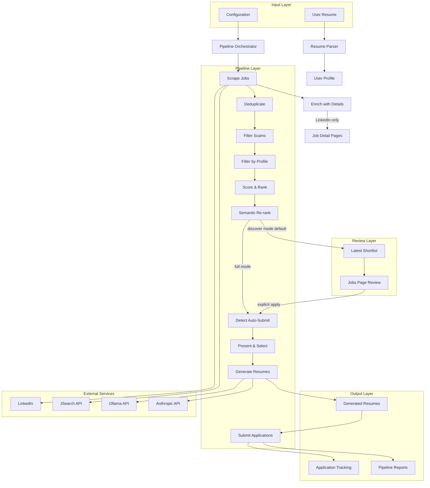

Default **discover** mode stops after semantic re-rank, writes `data/results/latest_shortlist.json`, and expects review on the Jobs page before any apply. Full mode continues through detect / generate / submit (dry-run by default).

## Component Architecture

### 1. LLM Layer

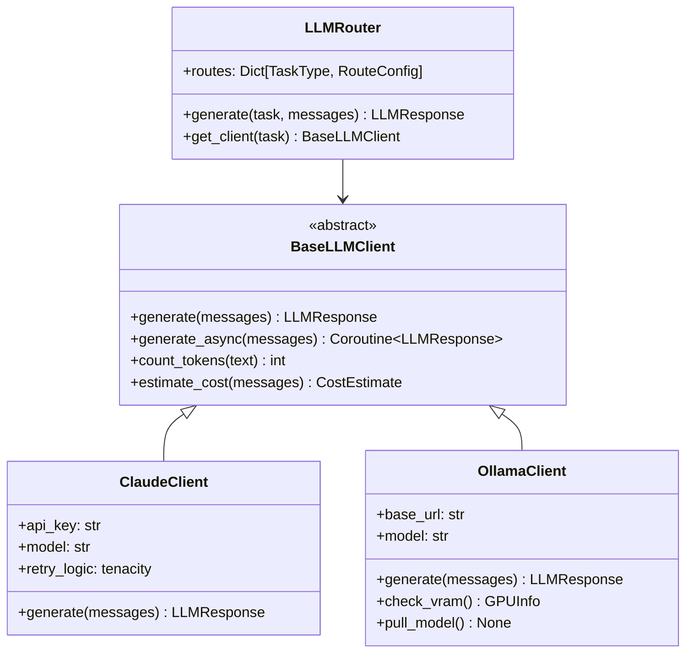

### 2. Data Models

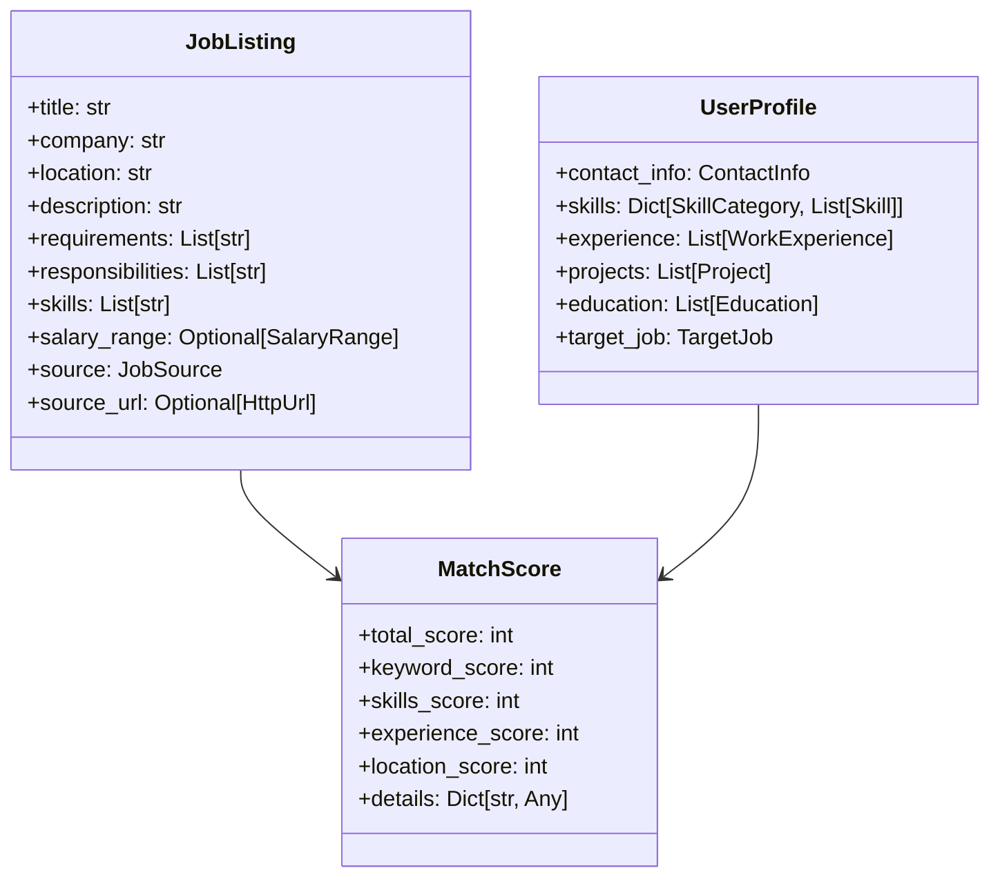

### 3. Pipeline Stages

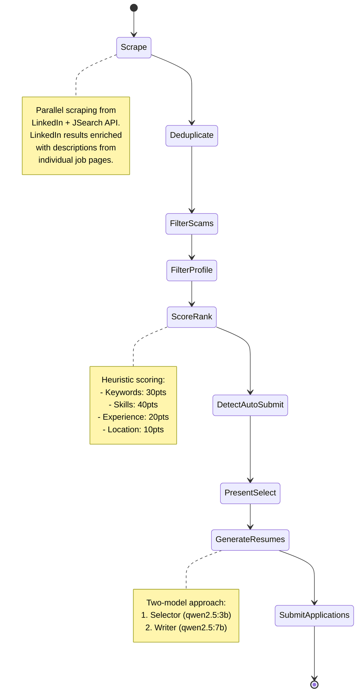

## Two-Model Architecture

### Resume Generation Strategy

Job Raider uses a two-model approach to optimize cost and quality:

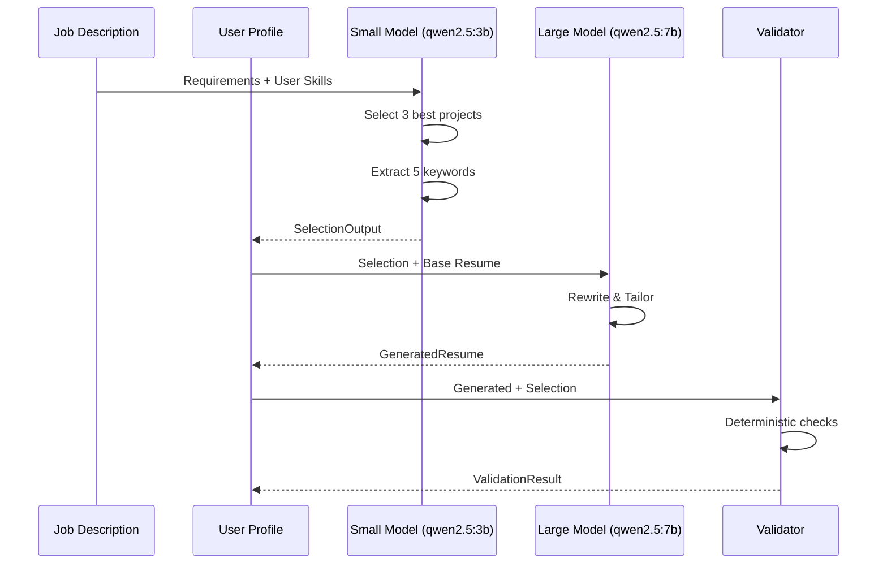

**Benefits:**
- **Cost Reduction:** 80% of calls use free local model
- **Quality:** Large model ensures high-quality writing
- **Context Control:** Small model extracts signal, reduces hallucination
- **Validation:** Deterministic checks prevent fabrication

### Model Selection for 8GB VRAM

Recommended defaults (also shown in Settings as **Use recommended (3b / 7b)**):

| Model | Parameters | VRAM Usage | Use Case | Cost |
|-------|-----------|------------|----------|------|
| qwen2.5:3b | 3B | ~2 GB | Selection, Scoring (small tier) | Free (local) |
| qwen2.5:7b | 7B | ~4 GB | Resume Writing (large tier) | Free (local) |
| gemma3:4b | 4B | ~2.5 GB | Alt. Selection | Free (local) |
| gemma3:12b | 12B | ~7 GB | Alt. Writing | Free (local) |
| claude-sonnet-4-6 | N/A | N/A | Fallback/API | ~$3/50 apps |

Any model installed on the shared Ollama host may be selected in **Settings → Ollama Models** and saved as the small/large tier defaults. `create_router()` loads those choices from user settings on each use.

### LLM response cache (kind A)

Settings ``enable_cache`` / ``cache_ttl`` control **exact response reuse** on the router only. This is not provider prompt-prefix caching and not Ollama ``keep_alive``.

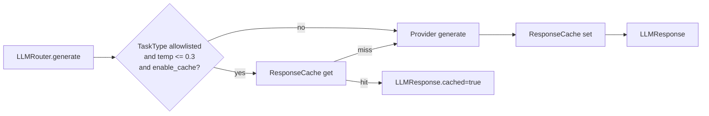

Allowlisted TaskTypes: ``validation``, ``jd_extraction``, ``resume_parsing``. Creative paths (cover-letter write/rewrite, assessment generation) never use the response cache.

### Paste JD structuring

Any user-supplied job description is treated as paste input and cleaned before scoring, generation, or storage.

| Surface | Path |
|---------|------|
| Cover letter (manual, assess, prep, validate, explain) | ``build_job_listing_from_paste`` |
| Resume analysis optional JD | ``build_job_listing_from_paste`` |
| Jobs classify / trust / cover-letter body | ``build_job_listing_from_job_data`` |
| Applications track-external metadata | ``clean_pasted_job_description`` |
| CLI ``analyze --job`` | ``build_job_listing_from_paste`` |

Scraped listings already normalize at ingest. Matcher scores empty structured skills from description overlap instead of awarding full skills weight.

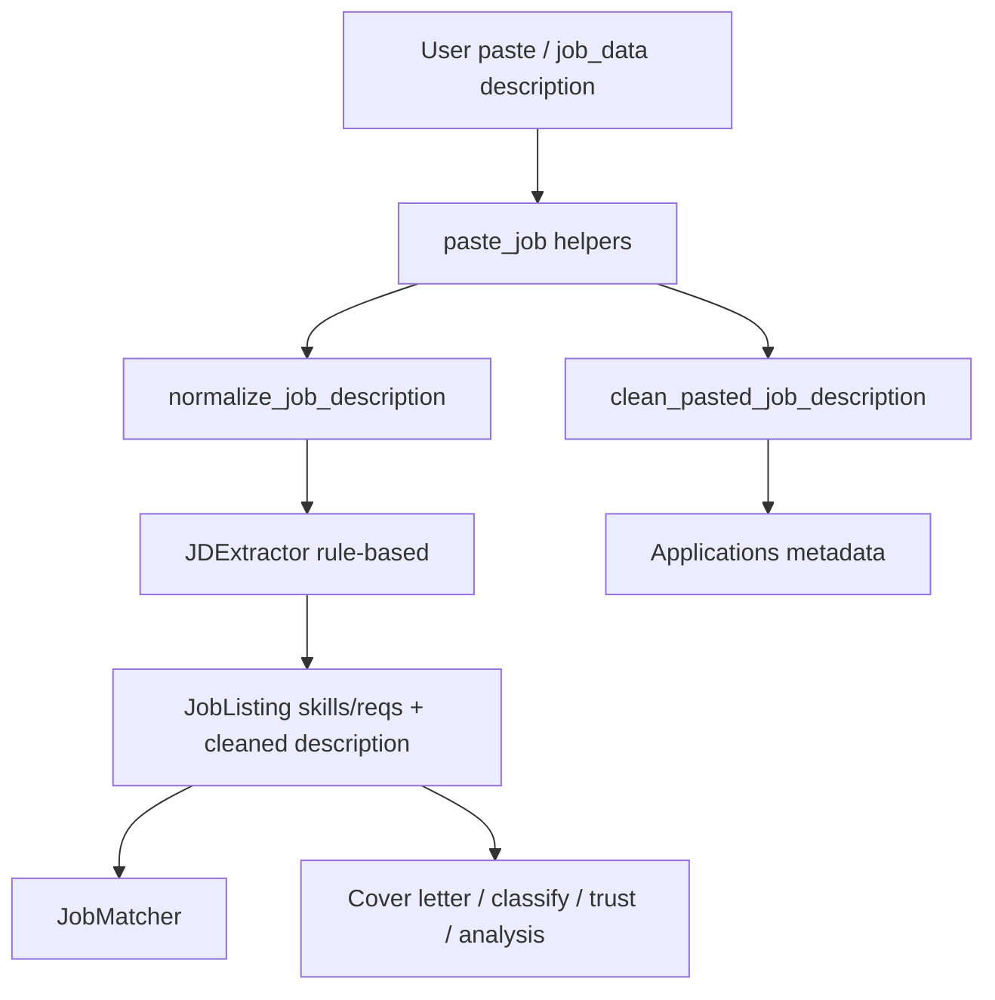

## Data Flow

### Pipeline Execution Flow


### Storage Architecture

Application outcomes under `data/applications/` are the source of truth for Save / Applied Elsewhere / tracker UI. With multi-worker uvicorn, each worker reloads that directory before reads and ID-based mutations so peer writes are visible (same pattern as file-backed profile state).

```
data/
├── listings/              # Scraped job listings
│   ├── 20260421_120000.json
│   └── 20260421_130000.json
├── applications/          # Application tracking (OutcomeTracker JSON files)
│   ├── {app_id}.json
│   └── ...
├── assessments/           # Assessment session data
│   ├── {session_id}.json
│   └── ...
├── profiles/              # Uploaded resumes and active profile store
├── settings/              # Persisted user_settings.json
├── cache/                 # LLM response cache
│   └── responses.json
├── metrics/               # Local metrics artifacts
└── results/               # Pipeline results
    ├── resumes/           # Generated resumes
    │   ├── {job_id}.pdf
    │   └── {job_id}.docx
    ├── applications/      # Application data
    │   └── {app_id}.json
    └── pipeline_run_*.json
```

Compose bind-mounts `apps/backend-py/data` into the backend container. The image pre-creates common folders, but an empty or partial host mount can hide them. The backend entrypoint and `DataDirectoryCheck` ensure expected directories exist on startup / health check.

## Scoring Heuristic

The relevance scoring algorithm uses a 100-point scale:

| Category | Points | Calculation |
|----------|--------|-------------|
| Keyword Match | 30 | (matched_keywords / target_keywords) × 30 |
| Skills Match | 40 | (matched_skills / total_skills) × 40 |
| Experience Level | 20 | Exact match: 20, Adjacent: 10, Mismatch: 0 |
| Location Preference | 10 | Exact match: 10, Same region: 5, Remote: 3 |

**Threshold:** 60+ points = worth applying

## Scam Detection

Job Raider includes 10 scam indicators:

1. **Payment Required** - Requests payment to work
2. **Personal Email** - Uses Gmail/Yahoo instead of company domain
3. **Messaging App Only** - Contact only via Telegram/WhatsApp
4. **Unrealistic Salary** - Hourly rates > $100 or too high for role
5. **Fake Company** - Suspicious company names (Confidential, Hidden)
6. **Vague Description** - Missing or too short description
7. **Poor Grammar** - Multiple grammar issues
8. **Immediate Hire** - "Start today", "no interview"
9. **Suspicious Title** - Unrealistic earnings claims
10. **Phishing Links** - Suspicious external URLs

**Scoring:** Each indicator adds 10-50 points. Threshold 70 = scam.

## Auto-Submit Detection

The system detects three types of application methods:

| Method | Description | Action |
|--------|-------------|--------|
| Easy Apply | Platform native quick apply | Auto-submit (dry-run first) |
| External Site | Redirects to company ATS | Flag for manual application |
| Manual | Requires custom process | Flag for manual application |

## Fresh Graduate Scoring Mode

For entry-level candidates with limited work experience, Job Raider offers a fresh graduate scoring mode:

| Category | Points | Standard Mode | Fresh Grad Mode |
|----------|--------|--------------|-----------------|
| Projects | 0 | - | **35** |
| Skills | 40 | Skills match | **30** |
| Education | 0 | - | **20** |
| Experience | 20 | Work history | **10** |
| Location | 10 | Geography | **5** |

**Threshold:** 50+ points (reduced from 60) to increase opportunities for entry-level candidates.

**Configuration:**
- Enable via `--fresh-grad` CLI flag or `fresh_grad_mode: true` in API requests
- Weights configured in `apps/backend-py/config/scoring_config.yaml`
- Projects prioritized: academic capstone (20pts), personal (15pts), hackathon (10pts), research (15pts)
- Quality boosters: GitHub stars/forks (+3), deployed application (+3), blog posts (+2)

## Assessment Components

### DISC Personality Assessment

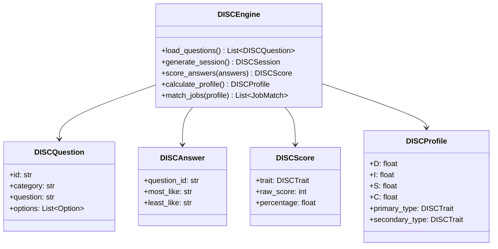

**Features:**
- **Format:** Most/Least forced-choice (industry standard)
- **Questions:** 24 across 4 categories (Leadership, Communication, Work Style, Problem Solving)
- **Scoring:** +3 for most like, -3 for least like per trait
- **Profile:** D/I/S/C percentages with primary/secondary types
- **Job Matching:** Matches profile against ideal profiles for Software Engineer, Sales, PM, Data Analyst, Team Lead

**Components:**
- `src/assessment/disc_engine.py` - Core scoring and matching logic
- `src/api/routes/assessment.py` - REST endpoints for assessment operations
- `config/disc_questions.json` - Question bank (24 questions)
- `config/disc_job_profiles.json` - Ideal job type profiles

### Technical Assessment Trainer

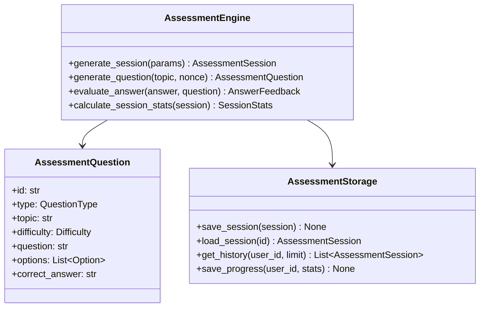

**Features:**
- **Dynamic Questions:** LLM-generated (never from fixed bank) with random nonce and shuffled topics
- **Modes:** Job-targeted (based on specific job) and skill-based (general practice)
- **Formats:** Freeform (LLM-evaluated) and multiple-choice
- **Adaptive Difficulty:** Adjusts after every 3 answers based on average score
- **Progress Tracking:** Aggregate stats, score trend, strongest/weakest topics

## Multi-Agent Layer

The multi-agent system (`src/agents/`) provides coordinated, asynchronous career-coaching services on top of the LLM layer. It is registered as a FastAPI router (`/api/agents/*`) and initialized during application startup.

### Components

- **`BaseAgent`** (`base.py`) - abstract contract defining the agent lifecycle (`AgentState`: INITIALIZING, READY, BUSY, etc.), `Task` / `TaskResult` / `TaskType`, and `AgentCapability` (declared task types, parallel execution flag, dependencies).
- **`AgentCoordinator`** (`coordinator.py`) - central orchestrator: registers agents, dispatches tasks to the optimal agent by capability, runs multi-stage pipelines, and tracks per-agent performance/utilization.
- **`AgentCommunicationBus`** (`communication.py`) - in-process message bus agents use to exchange `AgentMessage`s (with TTL and bounded history), enabling cross-agent collaboration.
- **`CareerCoachAgent`** (`career_coach.py`) - the first concrete agent: career-path analysis, skill gap analysis, upskilling roadmaps, SMART goal setting, and skill-development planning. Powered by an `LLMRouter`.
- **Rate limiter** (`src/api/rate_limiter.py`) - per-client, per-endpoint throttling applied on the mutating agent endpoints.
- **Config** (`config/agent_config.yaml`, loaded by `config_loader.get_agent_config()`) - coordinator, career-coach, and communication settings (concurrency, timeouts, recommendation thresholds, message size/history/TTL).

### Request Flow

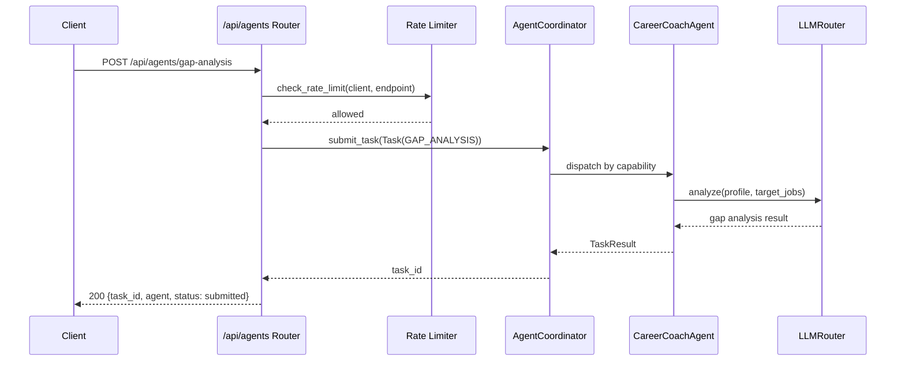

### Lifecycle

The coordinator is started once at application startup (`lifespan` in `src/api/main.py`) via `initialize_agent_system(LLMRouter())`. Initialization is wrapped in a `try/except` and is **non-fatal**: if it fails, the API still boots and the agent endpoints return HTTP 503 ("Agent system not initialized") until a successful startup. The coordinator's background `asyncio` task is retained on the singleton manager so it is not garbage-collected.

### Endpoints

| Method | Path | Purpose |
|--------|------|---------|
| GET | `/api/agents/status` | Agent and system status |
| GET | `/api/agents/performance` | Per-agent performance metrics |
| GET | `/api/agents/health` | Agent-system health check |
| POST | `/api/agents/shutdown` | Gracefully shut down the agent system |
| POST | `/api/agents/career-analysis` | Trigger career-path analysis |
| POST | `/api/agents/gap-analysis` | Analyze skill gaps vs. target jobs |
| POST | `/api/agents/upskilling-roadmap` | Generate an upskilling roadmap |
| POST | `/api/agents/career-goals` | Set SMART career goals |
| GET | `/api/agents/recommendations` | Career recommendations |

## Frontend Architecture

The web dashboard is built with Next.js 16 (App Router) + Tailwind CSS + shadcn/ui.

```mermaid
graph LR
    subgraph "Browser"
        Pages[10 App Router Pages]
        Components[Layout + UI Components]
    end

    subgraph "Next.js Server"
        Proxy[/api/proxy/path Route Handler]
    end

    subgraph "FastAPI Backend"
        Routes[API Routes]
        Auth[verify_api_key Dependency]
    end

    Pages -->|fetch /api/proxy/*| Proxy
    Proxy -->|X-API-Key header + forward| Auth
    Auth --> Routes
```

### Key Design Decisions

- **Server-side proxy:** All backend calls go through `/api/proxy/[...path]` — a Next.js Route Handler that injects `X-API-Key` from a server-only env var. The API key is never exposed to the browser.
- **TanStack Query:** All data fetching uses `useQuery` / `useMutation` with automatic caching and refetch.
- **App state context:** Cross-page state (selected job, active pipeline run, saved jobs) lives in a React context populated at the root layout.
- **Error boundary + Suspense:** Every page is wrapped in an `ErrorBoundary` and `<Suspense fallback={<PageSkeleton />}>` in the AppShell.
- **Mobile nav:** Sidebar hidden below `md` breakpoint; a Sheet drawer with hamburger toggle shown instead.

### Pages

| Route | Purpose |
|-------|---------|
| `/dashboard` | Health checks, quick stats, recent pipeline runs |
| `/pipeline` | Discover (default) or full pipeline; live monitor; history; Review on Jobs CTA |
| `/jobs` | Latest discover shortlist, live search, split-panel list + detail; save/apply; optional Use profile targets |
| `/applications` | Tracker: All / Saved / Hidden tabs, track external |
| `/profile` | Resume upload (dropzone), parsed profile display, editable Job Targets |
| `/resume-analysis` | Upload + optional JD → AI score, gaps, recommendations |
| `/linkedin-analysis` | LinkedIn profile analyzer and inbound-attraction recommendations |
| `/cover-letter` | Manual JD paste → generate/review/export cover letter |
| `/career-coach` | Agent-backed career analysis (requires active profile) |
| `/metrics` | Recharts funnel + pie, cost tiles, LLM call log |
| `/settings` | Ollama host, cloud fallback provider (Anthropic/Gemini) + API key, installed-only small/large model pickers, model params, cost limits; local color schemes and cinematic atmosphere |
| `/assessment` | DISC work-style assessment and skill-based technical interview practice |

### Appearance Color Schemes

Light/dark mode stays on the sidebar toggle. Color schemes are a separate local preference (`data-scheme` on the document root). Settings Appearance shows an Odysseus-inspired swatch-card grid for curated presets. A Customize panel stays on the roadmap.

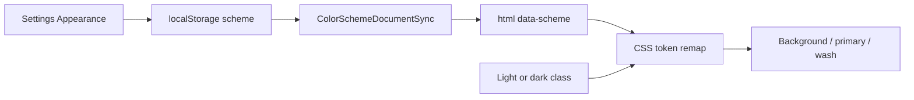

| Scheme | Intent |
|--------|--------|
| Raid (default) | Current red-accent ops look |
| Neon | Cyan primary, magenta accent, cool wash |
| Retrowave | Hot pink primary, electric blue accent, dusk purple surfaces |
| Gunmetal | Steel / graphite neutrals, muted blue-steel accents |
| Terminal | Console green on dark surfaces |
| Hackerman | Black / neon-green matrix ops (punchier than Terminal) |
| Midnight | Calm deep-blue surfaces |
| Paper | Print-like cream / ink (light-first) |
| Forest | Nature greens |
| Ocean | Deep teal / cyan |
| Copper | Warm metal accents |
| Stained glass | Jewel gold / violet (token remap; optional frost later) |

Schemes remap design tokens only. They do not replace light/dark or cinematic atmosphere.

### Cover Letter Generation And Grounding

Cover letters use a local-first draft path, then deterministic proofreading. The grader must not treat vague wording the same as fabricated scope.

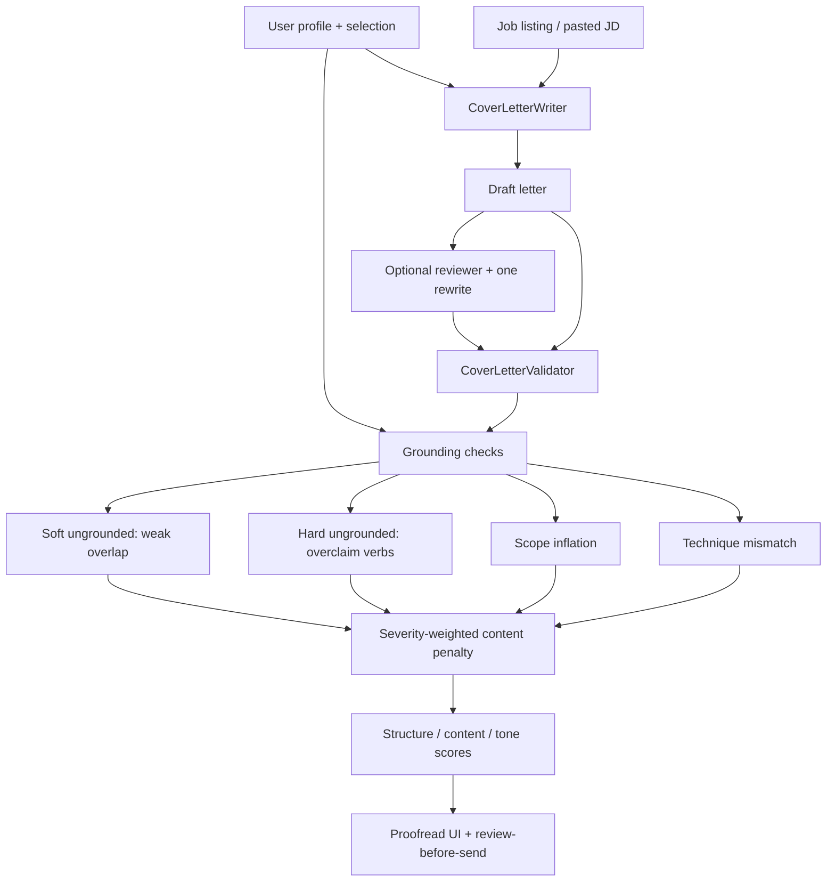

| Finding | Typical meaning | Content penalty per hit |
|---------|-----------------|-------------------------|
| Soft ungrounded | Weak resume/JD lexical overlap | 3 |
| Hard ungrounded | Capability verbs such as deployed / production / shipped without resume support | 10 |
| Scope inflation | Leadership phrasing beyond IC bullets | 12 |
| Technique mismatch | Named technique not verified for the referenced project | 10 |

The grounding bucket is capped at 50 so other content checks remain visible. Issue enums still flag findings for review; only the numeric content score uses severity weights. Implementation lives in `apps/backend-py/src/generation/cover_letter_grounding.py` and `cover_letter_validator.py`.

## Security Considerations

1. **API Keys:** Backend key in `apps/backend-py/.env`, frontend key in `apps/frontend-ts/.env.local` — neither committed
2. **X-API-Key auth:** All FastAPI routes protected by `verify_api_key` dependency; bypassed only when `API_KEY` env var is unset (local dev)
3. **Server-only proxy:** `BACKEND_API_URL` and `API_KEY` are server env vars — never bundled into client JS
4. **Dry Run Mode:** Default for all submissions
5. **Rate Limiting:** 2 sec delay, 30 per hour max
6. **Data Privacy:** Local processing, resume data never leaves system
7. **Scam Protection:** Multi-layer scam detection before processing

## Deployment Architecture

### Docker Service Topology

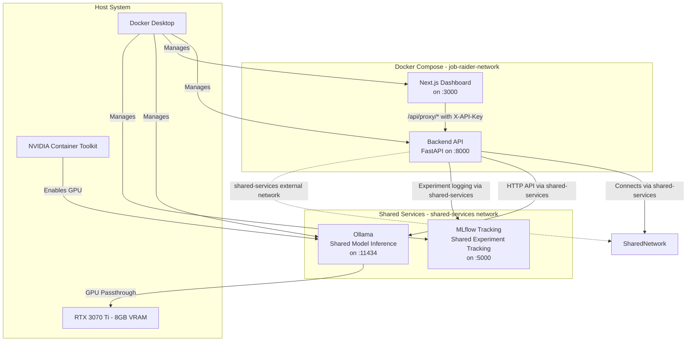

### Container Configuration

| Service | Image | Port | GPU | Purpose |
|---------|-------|------|-----|---------|
| backend | Custom (CUDA 12.4.0) | Dynamic (default 8000) | No | FastAPI REST API, pipeline orchestration |
| frontend | Custom (Node 20 Alpine) | Dynamic (default 3000) | No | Next.js web dashboard |
| **ollama** | **ollama/ollama:latest** | **Dynamic (default 11434)** | **Yes (NVIDIA)** | **Shared local LLM inference for all projects** |
| **mlflow** | **ghcr.io/mlflow/mlflow:latest** | **5000** | **No** | **Shared experiment tracking for all projects** |

**Note:** Ollama and MLflow are shared services running on `~/docker-services/docker-compose.yml` with persistent volumes for models and experiments. All projects connect via the external `shared-services` Docker network.

### GPU Passthrough

GPU acceleration is configured via the NVIDIA Container Toolkit:

- The Ollama container receives GPU access through Docker's `deploy.resources.reservations.devices` configuration
- CUDA 12.4.0 runtime is used in the backend container for compatibility with the host driver (595.79, CUDA 13.2)
- Ollama automatically detects and uses CUDA for model inference when GPU is available
- Models (qwen2.5:3b, qwen2.5:7b) are stored in a persistent Docker volume (`ollama-data`) and pulled on first use

### Dynamic Port Allocation

Ports are allocated dynamically to avoid conflicts with other services:

- `docker-run.sh` calls `scripts/find-port.sh` to discover available ports starting from the default
- Port assignments are passed to docker-compose via environment variables (`BACKEND_PORT`, `OLLAMA_PORT`, `FRONTEND_PORT`)
- The docker-compose.yml uses the extended port definition format with `${VAR:-default}` interpolation

### Inter-Service Communication

- Frontend to Backend: Next.js proxy at `/api/proxy/*` forwards to `http://backend:8000` (Docker) or `http://localhost:8000` (local)
- Backend to Ollama: HTTP API calls via shared-services network (`http://ollama:11434`)
- Backend to MLflow: Experiment logging via shared-services network (`http://mlflow:5000`)
- Job-raider services use `job-raider-network` bridge network
- Shared services (Ollama, MLflow) use `shared-services` external bridge network
- Backend connects to both networks for cross-project service access
