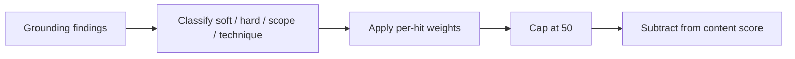

# Job Raider Decision Log

## 2026-07-28 — Cover letter grounding uses severity-weighted penalties

### Context

Deterministic cover-letter proofreading flags ungrounded sentences, scope inflation, and technique mismatches. Early scoring applied a flat content deduction per issue type (for example −20 for any ungrounded claims). Soft vague wording and fabricated scope therefore produced similar scores, even when writing quality improved.

### Decision

Score grounding findings by severity and count instead of a flat per-issue hit:

- Soft ungrounded (weak overlap): −3 each
- Hard ungrounded (overclaim verbs such as deployed / production / shipped): −10 each
- Scope inflation: −12 each
- Technique mismatch: −10 each
- Cap the grounding bucket at −50

Issue enums still surface findings for manual review. Only the numeric content score uses the weighted penalty. The validation `details.grounding_penalty` object records the breakdown for UI and debugging.

### Consequences

- Content scores track writing improvement more clearly.
- Soft CTA phrasing no longer equals leadership inflation.
- Callers that assumed a fixed −20/−15/−15 grounding hit must read `grounding_penalty` instead.

### Flow

