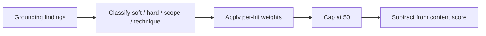

# Job Raider Decision Log

## 2026-07-28 ? Cover letter grounding uses severity-weighted penalties

### Context

Deterministic cover-letter proofreading flags ungrounded sentences, scope inflation, and technique mismatches. Early scoring applied a flat content deduction per issue type (for example ?20 for any ungrounded claims). Soft vague wording and fabricated scope therefore produced similar scores, even when writing quality improved.

### Decision

Score grounding findings by severity and count instead of a flat per-issue hit:

- Soft ungrounded (weak overlap): ?3 each
- Hard ungrounded (overclaim verbs such as deployed / production / shipped): ?10 each
- Scope inflation: ?12 each
- Technique mismatch: ?10 each
- Cap the grounding bucket at ?50

Issue enums still surface findings for manual review. Only the numeric content score uses the weighted penalty. The validation `details.grounding_penalty` object records the breakdown for UI and debugging.

### Consequences

- Content scores track writing improvement more clearly.
- Soft CTA phrasing no longer equals leadership inflation.
- Callers that assumed a fixed ?20/?15/?15 grounding hit must read `grounding_penalty` instead.

### Flow

## 2026-08-01 ? Neon and Retrowave local color schemes

### Context

Users want optional playful palettes without replacing the default Raid ops look or the light/dark toggle.

### Decision

Add a third appearance layer: `data-scheme` with `default` (Raid), `neon`, and `retrowave`. Persist in localStorage. Remap CSS design tokens for both light and dark. Keep cinematic atmosphere independent.

### Consequences

- Settings Appearance gains a color-scheme picker.
- New schemes require only CSS token packs plus labels; no page rewrites.
- Avoid shipping many schemes until these two are stable in daily use.

## 2026-08-02 ? DISC current-state polish and session safety

### Context

DISC needed clearer work-style framing and tighter submit validation before adding more visualizations. A pre-existing risk allowed client ``session_id`` values to influence result filenames.

### Decision

- Frame DISC as workplace-style practice, not a full personality inventory.
- Validate answers (full coverage, Most != Least) and require UUID ``session_id`` before save.
- Keep richer charts and ladder-based recommendations on standby.

### Consequences

- Invalid DISC submits return HTTP 400.
- Result files stay under ``data/disc_results/`` for UUID session ids only.

## 2026-08-05 - LLM page enrichers stay loosely coupled (ScrapeGraphAI on standby)

### Context

LinkedIn (and similar) detail enrichment still fails when selectors or JSON-LD miss, leaving empty shortlist descriptions. ScrapeGraphAI is a popular LLM+graph scraping option that could help, but better libraries or in-house prompts may appear quickly. Wiring any one vendor deep into `linkedin_scraper` or the pipeline would make swap-out expensive.

### Decision

Do **not** adopt ScrapeGraphAI (or any LLM page enricher) as a core scrape dependency yet. If a spike later proves value, integrate only behind a narrow port:

- Interface such as `JobDetailEnricher` (URL or HTML in; structured fields out, at least `description`)
- Optional/pluggable backend (CSS/JSON-LD first; LLM enricher as fallback only)
- No changes to JSearch or the default search-card scrape path
- Soft dependency (optional extra), feature-flagged, capped per run
- Ollama-first config; no managed cloud API required for the OSS path

Success metrics for any future spike: empty-JD rate down, latency/cost within budget, no auth regressions vs current Playwright session.

### Consequences

- Core pipeline remains deterministic HTML/API scrape + existing post-text LLM tools
- Tomorrow's better enricher can replace the adapter without rewriting scoring, RAG, or shortlist contracts
- Research stays on standby until go/no-go criteria from the considerations list are met

## 2026-08-06 - Appearance UX inspired by Odysseus, housed in Settings

### Context

Odysseus exposes themes in a dedicated Theme window: a swatch-card grid (Themes) plus a Customize panel (colors, harmony, font and layout, save/import/export). Job Raider already has light/dark, cinematic atmosphere, and `data-scheme` presets (Raid, Neon, Retrowave). Users want a richer theme experience without leaving the Settings pattern used by the rest of the product.

### Decision

- Keep Appearance inside **Settings** (not a separate Theme mini-window or top-level tab page).
- Borrow Odysseus **display patterns**: preset cards with three color swatches and a strong selected state; later a Customize section for token-level colors and layout density.
- Grow a **curated** preset list that includes Job Raider-only schemes (Gunmetal, Stained glass, Hackerman) and selected Odysseus-overlap schemes (Terminal, Midnight, Paper, etc.). Do not port the full Odysseus catalog (skip gpt/claude/cute/organs unless explicitly requested later).
- Continue implementing presets as CSS token remaps under `data-scheme` so schemes stay loosely coupled from components.

### Consequences

- Settings swatch grid covers the full curated catalog (Raid through Stained glass).
- Customize (pickers / harmony / density) is phase-two and optional.
- Theme work stays localStorage-only and orthogonal to light/dark and cinematic.

## 2026-08-07 - LLM response cache is allowlisted (kind A only)

### Context

Settings already exposes ``enable_cache`` / ``cache_ttl``, and ``ResponseCache`` exists, but the LLM router never consulted it. "Caching" also conflates four mechanisms: exact response reuse (A), provider prompt-prefix caching (B), Ollama model warm/keep_alive (C), and embedding TTL (D, already live). Wiring everything behind one toggle would risk stale creative cover letters and false cost confidence.

### Decision

- Treat Settings ``enable_cache`` / ``cache_ttl`` as **kind A (response cache) only**. Provider prefix cache (B) and Ollama keep_alive (C) stay separate future work with their own flags.
- Wire ``ResponseCache`` inside ``LLMRouter.generate`` / ``generate_async``.
- Cache only an **allowlist** of TaskTypes that are low-creativity and often re-run on identical inputs: ``validation``, ``jd_extraction``, ``resume_parsing``.
- Additional guard: cache only when ``temperature <= 0.3`` (covers current extract/parse/validate call sites). Creative tasks (cover-letter write/rewrite, assessment generation, etc.) never hit the cache even if Settings cache is on.
- Fail open: cache read/write errors must not block generation.
- Mark ``LLMResponse.cached`` on hits; expose hit/miss counts on router stats.
- Do **not** enable Anthropic ``cache_control`` or Ollama ``keep_alive`` in this change.

### Consequences

- Re-running the same validate/extract/parse request within TTL avoids a second model call.
- Cover-letter generation quality and novelty are unchanged.
- Phases 2+ (prompt hygiene, cloud prefix cache, keep_alive) remain gated in ``tasks/todo.md``.

## 2026-08-07 - Paste JD paths normalize and structure without LLM

### Context

Cover-letter (and resume-analysis) paste flows assumed users would supply clean text, but real use is highlight-drag from LinkedIn/careers pages. Those paths built a ``JobListing`` with only a raw ``description``, skipping ``normalize_job_description`` and ``JDExtractor``. ``JobMatcher`` then awarded the full skills weight when ``job.skills`` was empty, so paste assess scores were optimistically high.

### Decision

- Add ``build_job_listing_from_paste`` (rules only, no LLM): normalize text, then rule-extract skills/requirements/responsibilities while preserving user title/company/location and the full cleaned description.
- Wire cover-letter manual/assess/validate/explain-fit and resume-analysis JD paste through that helper.
- When structured required skills are empty, score skills from description overlap against the profile (mid weight baseline; never full weight).

### Consequences

- Paste and scrape ingestion share the same normalizer.
- Fit scores on paste are less inflated.
- LLM ``JD_EXTRACTION`` on every paste remains optional future work if rules prove thin.

## 2026-08-07 - All JD paste surfaces share one structuring path

### Context

Paste is not limited to the cover-letter tab. Users also drag-copy full JDs into resume analysis, applications track-external, jobs classify/trust/cover-letter payloads, and CLI analyze. Leaving any of those on raw blobs reintroduces optimistic matcher scores and HTML crumb prompts.

### Decision

- Treat every user-supplied job description string as paste input.
- Route full listings through ``build_job_listing_from_paste`` / ``build_job_listing_from_job_data``.
- Route metadata-only storage (applications) through ``clean_pasted_job_description``.
- Do not apply this to LinkedIn profile paste (different domain) or assessment sessions that load jobs by id.

### Consequences

- One module owns paste hygiene for JD text.
- Interview prep from tracked external apps receives cleaned stored descriptions.
- New paste features should import the helper rather than building ``JobListing`` ad hoc.

## 2026-08-07 - Messy JD paste fixtures drive normalizer/extractor hardening

### Context

Highlight-drag pastes routinely include LinkedIn UI chrome, HTML crumbs, mid-sentence cuts, and prose with no section headers. Rules-only structuring must stay honest on those shapes without LLM cost on every paste.

### Decision

- Keep a fixture pack under ``tests/fixtures/jd_paste/`` with golden expectations for clean text, skills, and requirements.
- Harden ``normalize_job_description`` for LinkedIn chrome and trailing highlight cuts.
- Harden ``JDExtractor`` for whole-line section headers, broader skills, and salary patterns that ignore experience years.
- Defer optional LLM ``JD_EXTRACTION`` fallback and frontend paste hints until real-hunt fixtures show rules are thin.

### Consequences

- Paste regressions are caught in unit CI before matcher/LLM paths see bad structure.
- Real job-hunt pastes (PII-stripped) can extend the pack without changing the paste helper API.

## 2026-08-07 - LinkedIn profile normalize and LLM cache flags B/C

### Context

LinkedIn profile paste and URL fetch text included UI chrome (Show more, Connect, follower counts). Assessment freeform and cover-letter bodies lacked bounds. Optional JD LLM extract, Anthropic prompt-prefix cache, and Ollama keep_alive needed settings-backed toggles.

### Decision

- Add ``normalize_linkedin_profile_text`` and ``normalize_user_prose`` in ``text_normalizer.py``; wire LinkedIn analyze/fetch and prose fields.
- Scope Playwright ``fetch_profile_text`` to ``main`` / card selectors before ``body`` fallback.
- Add ``CostLimits.enable_jd_llm_extract``, ``enable_prompt_cache``, ``ollama_keep_alive`` (defaults off/unset).
- Router passes prompt cache and keep_alive into Claude/Ollama clients; cover-letter manual paste may opt into LLM JD extract.

### Consequences

- Profile analysis prompts are cleaner without LinkedIn button noise.
- Three cache kinds are distinct in settings UI: response (A), Anthropic prompt (B), Ollama keep_alive (C).
- JD paste LLM fallback remains opt-in to control API cost.

## 2026-08-07 - Assessment prompt templates restored under prompts

### Context

``question_answering`` and assessment generation/evaluation templates were nested under top-level ``job_scraping`` in ``prompt_templates.yaml``, so ``AssessmentEngine`` could not load ``prompts["assessment_generation"]``.

### Decision

Move those templates back under ``prompts`` and leave ``job_scraping`` with keywords/locations/experience levels only. Keep assessment ``SESSION NONCE`` at the end of the user template for prefix stability.

### Consequences

- Assessment generation loads templates correctly again.
- Phase 2 nonce placement is preserved for future Anthropic prefix cache.

## 2026-08-08 - Default search location Singapore

### Context

The operator is based in Singapore. Config and UI defaults still preferred US metros (San Francisco, New York, Seattle).

### Decision

Set default locations to ``Singapore`` then ``Remote`` in ``search_config.yaml``, ``scoring_config.yaml``, and ``job_scraping`` defaults. Prefill Jobs search and Pipeline location fields with ``Singapore``.

### Consequences

- Fresh searches and pipeline runs target Singapore without profile prefill.
- Profile target locations still override when the user enables profile-target prefill.
