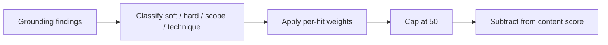

# Job Raider Decision Log

## 2026-07-28 — Cover letter grounding uses severity-weighted penalties

### Context

Deterministic cover-letter proofreading flags ungrounded sentences, scope inflation, and technique mismatches. Early scoring applied a flat content deduction per issue type (for example −20 for any ungrounded claims). Soft vague wording and fabricated scope therefore produced similar scores, even when writing quality improved.

### Decision

Score grounding findings by severity and count instead of a flat per-issue hit:

- Soft ungrounded (weak overlap): −3 each
- Hard ungrounded (overclaim verbs such as deployed / production / shipped): −10 each
- Scope inflation: −12 each
- Technique mismatch: −10 each
- Cap the grounding bucket at −50

Issue enums still surface findings for manual review. Only the numeric content score uses the weighted penalty. The validation `details.grounding_penalty` object records the breakdown for UI and debugging.

### Consequences

- Content scores track writing improvement more clearly.
- Soft CTA phrasing no longer equals leadership inflation.
- Callers that assumed a fixed −20/−15/−15 grounding hit must read `grounding_penalty` instead.

### Flow

## 2026-08-01 — Neon and Retrowave local color schemes

### Context

Users want optional playful palettes without replacing the default Raid ops look or the light/dark toggle.

### Decision

Add a third appearance layer: `data-scheme` with `default` (Raid), `neon`, and `retrowave`. Persist in localStorage. Remap CSS design tokens for both light and dark. Keep cinematic atmosphere independent.

### Consequences

- Settings Appearance gains a color-scheme picker.
- New schemes require only CSS token packs plus labels; no page rewrites.
- Avoid shipping many schemes until these two are stable in daily use.

## 2026-08-02 — DISC current-state polish and session safety

### Context

DISC needed clearer work-style framing and tighter submit validation before adding more visualizations. A pre-existing risk allowed client ``session_id`` values to influence result filenames.

### Decision

- Frame DISC as workplace-style practice, not a full personality inventory.
- Validate answers (full coverage, Most != Least) and require UUID ``session_id`` before save.
- Keep richer charts and ladder-based recommendations on standby.

### Consequences

- Invalid DISC submits return HTTP 400.
- Result files stay under ``data/disc_results/`` for UUID session ids only.
