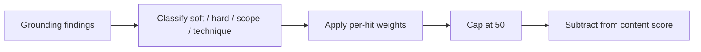

# Job Raider Decision Log

## 2026-07-28 ó Cover letter grounding uses severity-weighted penalties

### Context

Deterministic cover-letter proofreading flags ungrounded sentences, scope inflation, and technique mismatches. Early scoring applied a flat content deduction per issue type (for example ?20 for any ungrounded claims). Soft vague wording and fabricated scope therefore produced similar scores, even when writing quality improved.

### Decision

Score grounding findings by severity and count instead of a flat per-issue hit:

- Soft ungrounded (weak overlap): ?3 each
- Hard ungrounded (overclaim verbs such as deployed / production / shipped): ?10 each
- Scope inflation: ?12 each
- Technique mismatch: ?10 each
- Cap the grounding bucket at ?50

Issue enums still surface findings for manual review. Only the numeric content score uses the weighted penalty. The validation `details.grounding_penalty` object records the breakdown for UI and debugging.

### Consequences

- Content scores track writing improvement more clearly.
- Soft CTA phrasing no longer equals leadership inflation.
- Callers that assumed a fixed ?20/?15/?15 grounding hit must read `grounding_penalty` instead.

### Flow

## 2026-08-01 ù Neon and Retrowave local color schemes

### Context

Users want optional playful palettes without replacing the default Raid ops look or the light/dark toggle.

### Decision

Add a third appearance layer: `data-scheme` with `default` (Raid), `neon`, and `retrowave`. Persist in localStorage. Remap CSS design tokens for both light and dark. Keep cinematic atmosphere independent.

### Consequences

- Settings Appearance gains a color-scheme picker.
- New schemes require only CSS token packs plus labels; no page rewrites.
- Avoid shipping many schemes until these two are stable in daily use.

## 2026-08-02 ù DISC current-state polish and session safety

### Context

DISC needed clearer work-style framing and tighter submit validation before adding more visualizations. A pre-existing risk allowed client ``session_id`` values to influence result filenames.

### Decision

- Frame DISC as workplace-style practice, not a full personality inventory.
- Validate answers (full coverage, Most != Least) and require UUID ``session_id`` before save.
- Keep richer charts and ladder-based recommendations on standby.

### Consequences

- Invalid DISC submits return HTTP 400.
- Result files stay under ``data/disc_results/`` for UUID session ids only.

## 2026-08-05 - LLM page enrichers stay loosely coupled (ScrapeGraphAI on standby)

### Context

LinkedIn (and similar) detail enrichment still fails when selectors or JSON-LD miss, leaving empty shortlist descriptions. ScrapeGraphAI is a popular LLM+graph scraping option that could help, but better libraries or in-house prompts may appear quickly. Wiring any one vendor deep into `linkedin_scraper` or the pipeline would make swap-out expensive.

### Decision

Do **not** adopt ScrapeGraphAI (or any LLM page enricher) as a core scrape dependency yet. If a spike later proves value, integrate only behind a narrow port:

- Interface such as `JobDetailEnricher` (URL or HTML in; structured fields out, at least `description`)
- Optional/pluggable backend (CSS/JSON-LD first; LLM enricher as fallback only)
- No changes to JSearch or the default search-card scrape path
- Soft dependency (optional extra), feature-flagged, capped per run
- Ollama-first config; no managed cloud API required for the OSS path

Success metrics for any future spike: empty-JD rate down, latency/cost within budget, no auth regressions vs current Playwright session.

### Consequences

- Core pipeline remains deterministic HTML/API scrape + existing post-text LLM tools
- Tomorrow's better enricher can replace the adapter without rewriting scoring, RAG, or shortlist contracts
- Research stays on standby until go/no-go criteria from the considerations list are met

## 2026-08-06 - Appearance UX inspired by Odysseus, housed in Settings

### Context

Odysseus exposes themes in a dedicated Theme window: a swatch-card grid (Themes) plus a Customize panel (colors, harmony, font and layout, save/import/export). Job Raider already has light/dark, cinematic atmosphere, and `data-scheme` presets (Raid, Neon, Retrowave). Users want a richer theme experience without leaving the Settings pattern used by the rest of the product.

### Decision

- Keep Appearance inside **Settings** (not a separate Theme mini-window or top-level tab page).
- Borrow Odysseus **display patterns**: preset cards with three color swatches and a strong selected state; later a Customize section for token-level colors and layout density.
- Grow a **curated** preset list that includes Job Raider-only schemes (Gunmetal, Stained glass, Hackerman) and selected Odysseus-overlap schemes (Terminal, Midnight, Paper, etc.). Do not port the full Odysseus catalog (skip gpt/claude/cute/organs unless explicitly requested later).
- Continue implementing presets as CSS token remaps under `data-scheme` so schemes stay loosely coupled from components.

### Consequences

- Settings swatch grid covers the full curated catalog (Raid through Stained glass).
- Customize (pickers / harmony / density) is phase-two and optional.
- Theme work stays localStorage-only and orthogonal to light/dark and cinematic.
