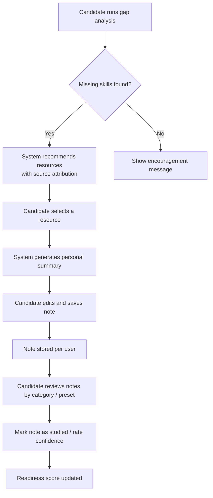
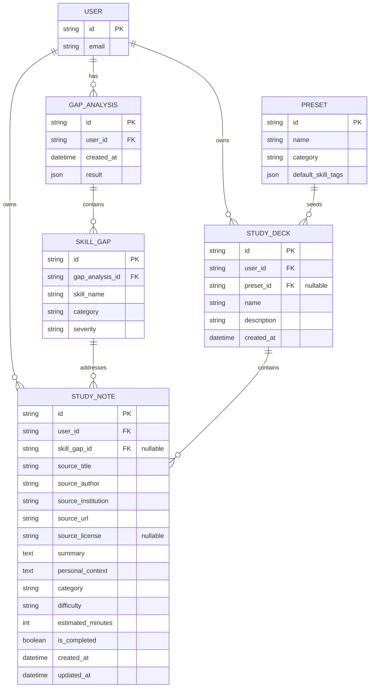
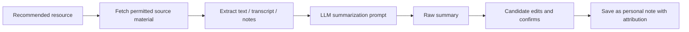

# Study Notes Trainer — Design Document

**Status:** Draft, on hold pending database and architecture decisions.  
**Purpose:** Capture the design and caveats for a personal study-notes feature so a future session can implement it without re-discovering the trade-offs.

---

## 1. Overview

The Study Notes Trainer is a candidate-facing learning aid integrated with the existing Career Coach / gap-analysis flow. It generates concise, personal study notes from recommended lectures, articles, or courses and organizes them by skill category, target job, and readiness level.

The feature is intentionally scoped as a **private note-taking tool**, not a public content library. Every note must carry source attribution.

### High-level goals

- Close identified skill gaps with focused, attributed study materials.
- Let candidates organize notes into topic-based presets and personal decks.
- Keep the feature useful even before a database is chosen by supporting generated, in-session suggestions.
- Avoid copyright and platform-terms risk by never redistributing third-party content.

---

## 2. User flow



---

## 3. Data model

This model assumes a relational database such as PostgreSQL. It can be adapted to MongoDB if that direction is chosen later.



---

## 4. Summarization pipeline



### Suggested prompt principles

- Ask the model to produce a **concise study note**, not a verbatim rewrite.
- Include the source metadata in the prompt so the model can preserve attribution.
- Request a `why this matters` sentence tied to the candidate’s target role.
- Cap output length so notes stay scannable.

---

## 5. Attribution requirements

Every study note must store and display:

| Field | Example | Required |
|---|---|---|
| Source title | “Attention and Transformer Networks” | Yes |
| Author / instructor | Christopher Manning | Yes |
| Institution | Stanford University | Yes |
| Source URL | `https://web.stanford.edu/class/cs224n/` | Yes |
| License or copyright notice | © Stanford, used under fair use for personal study | Yes, if known |
| Date accessed | 2026-07-11 | Recommended |

The UI should render this block above or below each note.

---

## 6. Caveats

### 6.1 Copyright and fair use

- Attribution is **required ethically and often by license**, but it does not by itself make a use fair use.
- Fair use depends on purpose, nature, amount, and market effect. Non-commercial, personal, transformative summaries of small portions are safer than redistributing full transcripts.
- **Do not** scrape YouTube videos or host full transcripts. Use official lecture notes, slide PDFs, or other materials Stanford has made available.
- Keep notes **private to the user**. Do not share notes across accounts or publish them.
- If the project later becomes commercial, re-evaluate every source category with legal counsel.

### 6.2 Platform terms

- YouTube’s Terms of Service generally prohibit automated downloading and transcription.
- Prefer sources that explicitly allow educational reuse or provide official transcripts.

### 6.3 Data privacy

- Notes may contain a candidate’s learning gaps and career aspirations. Treat them as sensitive user data.
- Enforce row-level access control so users can only read and modify their own notes.

### 6.4 Technical caveats

- **Database not chosen.** This design is intentionally database-agnostic. A final decision between PostgreSQL, MongoDB, or a managed service is required before implementation.
- **Summarization cost and rate limits.** LLM calls for every recommended resource could become expensive. Consider caching summaries by source URL so multiple users can reuse a generated summary while still keeping their own editable copy.
- **Quality control.** Generated summaries can be wrong or oversimplified. Always let the candidate edit before saving.
- **Source drift.** URLs and course pages change. Store enough metadata so a broken link is still attributable.

### 6.5 Scope creep

- Resist turning this into a public course catalog or content marketplace.
- Avoid adding social features (sharing decks, public leaderboards) without resolving redistribution rights.

---

## 7. Presets and categorization

### Preset decks

| Preset | Target roles | Example topics |
|---|---|---|
| Backend Engineering | Backend, platform, SRE | System design, databases, concurrency, distributed systems |
| Machine Learning | ML engineer, data scientist | Supervised learning, neural networks, NLP, evaluation |
| Frontend Engineering | Frontend, full-stack | React patterns, accessibility, performance, TypeScript |
| Behavioral & Leadership | Engineering manager, senior IC | STAR method, conflict resolution, ownership |
| Algorithms & Data Structures | General software engineer | Arrays, graphs, dynamic programming, complexity |

### Categorization

Reuse the existing skill categories in `UserProfile`:

- programming_language
- framework
- tool
- cloud
- database
- language
- soft_skill
- domain
- other

This lets gap-analysis results map directly onto study decks.

---

## 8. Proposed API endpoints

These are intentionally high-level and will need refinement once the data store is chosen.

```text
GET    /api/study-notes            list own notes
POST   /api/study-notes            create a note
GET    /api/study-notes/{id}       get a note
PATCH  /api/study-notes/{id}       update a note
DELETE /api/study-notes/{id}       delete a note
GET    /api/study-decks            list own decks
POST   /api/study-decks            create a deck
GET    /api/study-decks/{id}       get deck with notes
POST   /api/study-decks/{id}/notes add note to deck
POST   /api/study-notes/generate   generate summary from a source URL
GET    /api/study-presets          list available presets
```

---

## 9. Frontend UI outline

- **Career Coach tab: “Study Plan”**
  - Shows decks generated from the latest gap analysis.
  - Each deck lists notes with completion toggles.
- **Note editor**
  - Split view: source metadata on the left, editable summary on the right.
  - Pre-filled fields: title, author, institution, URL, license.
- **Resource recommendation card**
  - Title, source, estimated time, generate-summary button.
- **Progress indicator**
  - Percentage of notes marked studied per deck.

---

## 10. Open decisions

1. Which database to use (PostgreSQL, MongoDB, managed service).
2. Whether to store generated summaries in a shared cache keyed by source URL.
3. Which summarization model to use and how to handle rate limits / cost.
4. Whether to support importing official transcripts from Stanford course pages.
5. How to enforce privacy and row-level access control.

---

## 11. Next steps for a future session

1. Choose and provision the database.
2. Add `StudyNote`, `StudyDeck`, and `StudyPreset` models/tables.
3. Implement the summarization endpoint with source-attribution enforcement.
4. Add the “Study Plan” tab to the Career Coach page.
5. Write tests for CRUD, access control, and attribution validation.
6. Review the implementation against the copyright caveats in section 6.
