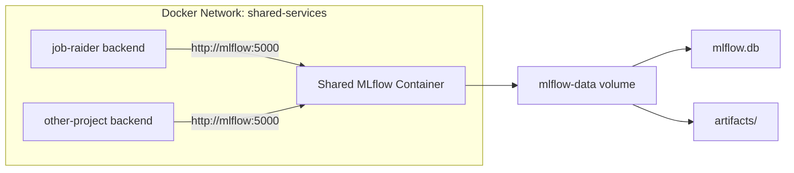

# Shared MLflow Setup

Job Raider uses a shared MLflow tracking server that runs independently from
the project. This avoids duplicating the MLflow image and volume across
multiple projects.

## Prerequisites

- Docker and Docker Compose installed
- Port 5000 available (or set `MLFLOW_PORT` to something else)

## One-Time Setup

Create a directory for shared Docker services and add the compose file:

```bash
mkdir -p ~/docker-services
```

Create `~/docker-services/docker-compose.yml` with the following content:

```yaml
# Shared Docker Services
# Standalone services shared across all projects

services:
  # Shared MLflow tracking server
  # Each project isolates data via mlflow.set_experiment("project-name")
  mlflow:
    image: ghcr.io/mlflow/mlflow:latest
    container_name: mlflow
    ports:
      - "${MLFLOW_PORT:-5000}:5000"
    volumes:
      - mlflow-data:/mlflow
    command: >
      mlflow server
      --host 0.0.0.0
      --port 5000
      --backend-store-uri sqlite:///mlflow/mlflow.db
      --default-artifact-root /mlflow/artifacts
      --allowed-hosts mlflow:5000,localhost:5000,127.0.0.1:5000
    restart: unless-stopped
    networks:
      - shared-services

volumes:
  mlflow-data:
    driver: local

networks:
  shared-services:
    name: shared-services
    driver: bridge
```

Then start the service:

```bash
cd ~/docker-services
docker compose up -d
```

## Verification

```bash
# Check container is running
docker ps --filter "name=mlflow"

# Check MLflow UI is accessible
curl http://localhost:5000
```

The MLflow UI is available at `http://localhost:5000`.

## Adding to Other Projects

Any project that needs MLflow tracking should:

1. Add the `shared-services` external network to its `docker-compose.yml`:

```yaml
networks:
  shared-services:
    external: true
```

2. Add the network to the service that uses MLflow:

```yaml
services:
  backend:
    networks:
      - my-project-network
      - shared-services
    environment:
      - MLFLOW_TRACKING_URI=http://mlflow:5000
```

3. Isolate experiment data per project:

```python
import mlflow
mlflow.set_experiment("my-project-name")
```

## Architecture



## Troubleshooting

**Container won't start:** Check if port 5000 is already in use:
```bash
lsof -i :5000
```

**Backend can't connect to MLflow:** Verify the `shared-services` network exists:
```bash
docker network inspect shared-services
```

**Permission denied on volume:** See `docs/docker-storage.md` for WSL2 volume
permission fixes.
