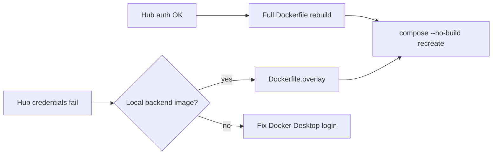

# Job Raider - Troubleshooting Guide

## Docker Issues

### Backend Unreachable / PermissionError on Data Directory

**Symptoms:**
```
PermissionError: [Errno 13] Permission denied: 'data/metrics'
```
Frontend returns `{"error":"Backend unreachable","message":"TypeError: fetch failed"}`. Container shows as healthy but all HTTP requests fail.

**Root Cause:**

When Docker bind-mounts a path from the Windows filesystem via WSL2 (e.g. `./data:/app/data` where the project is on a Windows drive), the mount appears inside the container as `root:root drwxr-xr-x` (755) regardless of host-side permissions. Any non-root container user will be denied write access.

**Fix:**

Add `user: root` to the backend service in `docker-compose.yml`:

```yaml
services:
  backend:
    user: root
    ...
```

Then restart the container:

```bash
docker compose restart backend
```

**Verification:**
```bash
curl -s http://127.0.0.1:8000/api/health | python3 -m json.tool
# All 5 checks should show "healthy"
```

**Note:** Using `localhost` instead of `127.0.0.1` can also cause "Connection reset by peer" in WSL2 because `localhost` resolves to `::1` (IPv6) while the server binds to `0.0.0.0` (IPv4). Always use `127.0.0.1` for direct health checks.

### Degraded Health: Data Directories Missing

**Symptoms:**
- Dashboard shows overall status `degraded`
- `GET /api/health` reports `data_directories` with a message such as:
  `Issues found: listings does not exist, cache does not exist, results does not exist`

**Root Cause:**

Compose bind-mounts `./apps/backend-py/data` over the image path. Folders created in the Dockerfile exist only in the image layer. If the host mount never had those folders (or Docker Desktop/WSL2 is serving a stale mount view), the container sees an incomplete tree and health degrades.

**Fix:**

```bash
# Prefer recreate so the bind mount refreshes and the entrypoint ensures dirs
docker compose up -d --force-recreate backend
```

Or create the folders on the host (same mount):

```bash
mkdir -p apps/backend-py/data/{listings,cache,results,applications,metrics,profiles,assessments,settings}
```

Then verify:

```bash
curl -s http://127.0.0.1:8000/api/health | python3 -m json.tool
```

`data_directories` should be `healthy`. After rebuilding with the current entrypoint/health check, missing expected folders are also created automatically when the mount is writable.

### Settings Shows Few Ollama Models / Wrong Host

**Symptoms:**
- Settings Ollama dropdowns only list models from the Compose `ollama` service
- Extra models on desktop Ollama do not appear
- Empty installed list while last-saved tags still show in the pickers

**Root Cause:**

Discovery uses `api_config.ollama_host` from saved settings. Inside Docker, `localhost:11434` is the backend container. `ollama:11434` is the Compose Ollama service. Desktop Ollama is typically `host.docker.internal:11434`.

If Dashboard health shows **Ollama unhealthy** with `base_url` `http://localhost:11434` while the shared `ollama` container is up, Settings still point at loopback. Set **Ollama Host** to `ollama:11434` (or `host.docker.internal:11434` for desktop Ollama) and save. Health checks also prefer Compose `OLLAMA_HOST` when Settings are loopback inside Docker.

**Fix:**

1. Open `/settings` and set **Ollama Host** appropriately:
   - Compose service: `ollama:11434`
   - Host desktop Ollama: `host.docker.internal:11434`
   - Native backend (no Docker): `localhost:11434`
2. Save, refresh Settings, then choose small/large from the live installed list

The Settings UI lists installed tags only (`ollama_installed`), not the YAML catalog. Saved models missing from that host remain visible as not installed.

### Sidebar GPU Meter Shows Em Dash

**Symptoms:**
- Sidebar Resources shows CPU/RAM but GPU is `—`

**Root Cause:**

`GET /api/health/resources` reads NVIDIA metrics via `nvidia-smi` inside the backend container. Without GPU passthrough on that service, `gpu` is `null`. Host Ollama may still use the GPU; the meter only reports what the backend process can see.

### WSL2 DrvFs Aggressive Caching - Stale Code in Containers

**Symptoms:**
- You fix code errors on the host (WSL2) but containers still see the old broken code
- Import errors persist even after restarting containers
- `docker compose restart` doesn't pick up file changes

**Root Cause:**

WSL2 uses the Windows file system (DrvFs) for bind mounts, which has aggressive caching. Docker containers read from the cache rather than the live filesystem, so recent changes may not be visible inside the container.

**Fixes:**

1. **Use proper container rebuild:**
   ```bash
   # Use this instead of 'restart' after code changes
   ./docker-rebuild.sh
   # Or manually:
   docker compose down && docker compose up -d
   ```

2. **Entrypoint auto-fix (already implemented):**
   - The `docker/docker-entrypoint.sh` script automatically fixes common import issues on startup
   - Detects and removes invalid pydantic imports like `field_serializer_validator`

3. **Direct container edit (last resort):**
   ```bash
   docker exec -it job-raider-backend sed -i 's/, field_serializer_validator//g' /app/src/models/user_profile.py
   docker compose restart backend
   ```

**Prevention:**
- Always use `docker compose down` + `up` (or the provided `docker-rebuild.sh`) after code changes
- Never use `docker compose restart` when you've modified Python/TypeScript code
- The entrypoint script will catch many issues automatically, but cache invalidation is still needed

### Docker Hub Credential Error Pulling CUDA Base

**Symptoms:**

```
failed to solve: error getting credentials - err: exit status 1
ERROR [internal] load metadata for docker.io/nvidia/cuda:12.4.0-runtime-ubuntu22.04
```

**Root Cause:**

Docker Desktop’s credential helper (`credsStore`) can fail even for public images. A full backend rebuild always resolves the NVIDIA CUDA base from Hub.

**Fixes:**

1. Confirm whether the base is already local:

```bash
docker image inspect nvidia/cuda:12.4.0-runtime-ubuntu22.04
```

2. If Hub auth is broken but `job-raider-backend:latest` exists, use a **code-only overlay** (no CUDA pull):

```bash
docker tag job-raider-backend:latest job-raider-backend:pre-overlay
docker build --network=none -t job-raider-backend:latest -f docker/Dockerfile.overlay .
docker compose up -d --no-build --force-recreate backend
```

3. Prefer a normal full rebuild once Docker Desktop login / `credsStore` works again:

```bash
docker compose up -d --build --force-recreate backend
```



### Empty Job Description on Jobs Shortlist

**Symptoms:**

- Shortlist shows title, company, score, and URL, but no description (or “No description captured”).
- Empty descriptions are almost always LinkedIn; JSearch listings usually include a JD.

**Root Cause:**

LinkedIn search cards often lack a full JD. Detail enrichment can fail (CSS selector drift or auth wall). Search-time enrichment is also capped, so scored jobs beyond that window may never get a description.

**What the product does:**

- Prefers JSON-LD `JobPosting.description` before CSS selectors.
- Re-enriches LinkedIn jobs on the shortlist before writing `data/results/latest_shortlist.json`.
- Backfills empty descriptions once on `GET /api/pipeline/shortlist/latest`.
- UI shows an explicit empty state with a link to the original posting when still missing.

**Operator tip:** Refresh Jobs after backend deploy so backfill can run. If LinkedIn blocks the container, use the original posting link.

### Applied Elsewhere Appears To Do Nothing

**Symptoms:**

- Toast may succeed or fail inconsistently; Jobs badge / Applications list does not update.

**Root Cause:**

Uvicorn can run multiple workers (`UVICORN_WORKERS`). Each process had its own in-memory `OutcomeTracker` cache while files live on the shared `data/applications` mount. A write on worker A was invisible to a read on worker B.

**Fix (shipped):**

Readers and mutators reload from disk (`_reload_cache`) so multi-worker processes stay coherent. Marking Applied Elsewhere updates an existing saved job instead of replacing it.

If symptoms persist after rebuild, confirm the backend image includes the reload fix and that `data/applications` is writable on the bind mount.

---

## Installation Issues

### Issue: Setup script fails

**Symptoms:**
```bash
./setup.sh
# Error: python: command not found
# Error: python3: command not found
```

**Solutions:**

1. **Install Python 3.11+:**
   ```bash
   # Ubuntu/Debian
   sudo apt update
   sudo apt install python3.11 python3.11-venv

   # Verify installation
   python3 --version
   ```

2. **Check Python path:**
   ```bash
   which python3
   # Should output: /usr/bin/python3 or similar
   ```

3. **Re-run setup:**
   ```bash
   ./setup.sh
   ```

### Issue: Virtual environment not activating

**Symptoms:**
```bash
source apps/backend-py/.venv/bin/activate
# Error: No such file or directory
```

**Solutions:**

1. **Re-create virtual environment:**
   ```bash
   cd job-raider
   rm -rf apps/backend-py/.venv
   python3 -m venv apps/backend-py/.venv
   source apps/backend-py/.venv/bin/activate
   ```

2. **Check Python venv module:**
   ```bash
   python3 -m venv --help
   # If error, install: sudo apt install python3.11-venv
   ```

3. **Run setup script:**
   ```bash
   ./setup.sh  # Will create venv in apps/backend-py/
   ```

### Issue: Dependencies fail to install

**Symptoms:**
```bash
cd apps/backend-py
pip install -r requirements.txt
# Error: Could not find a version that satisfies the requirement...
```

**Solutions:**

1. **Update pip:**
   ```bash
   cd apps/backend-py
   source .venv/bin/activate
   pip install --upgrade pip
   ```

2. **Install system dependencies:**
   ```bash
   # Ubuntu/Debian
   sudo apt install python3-dev build-essential

   # For Playwright
   sudo apt install libnss3 libnspr4 libatk1.0-0 libatk-bridge2.0-0 \
                    libcups2 libdrm2 libdbus-1-3 libxkbcommon0 libxcomposite1 \
                    libxdamage1 libxfixes3 libxrandr2 libgbm1 libasound2
   ```

3. **Install Playwright browsers:**
   ```bash
   cd apps/backend-py
   source .venv/bin/activate
   playwright install chromium
   ```

### Issue: Cover letter blank with Gemma 4 / thinking models

**Symptom:** Cover letter generate returns 200 but the letter body is empty when the large model is a thinking tag such as `gemma4:e4b`.

**Cause:** Ollama spends the `num_predict` budget on the `thinking` field and leaves `message.content` empty. Job Raider previously only read `content`.

**Fix:** Cover-letter generation passes ``think=false`` on that Ollama call only (shared client defaults are unchanged). Empty content is treated as a generation failure with a template fallback. Redeploy/overlay the backend after pulling this change, then regenerate.

```bash
docker tag job-raider-backend:latest job-raider-backend:pre-overlay
docker build --network=none -t job-raider-backend:latest -f docker/Dockerfile.overlay .
docker compose up -d --no-build --force-recreate backend
```

### Issue: Cover letter score stays low after writing improves

**Symptom:** The letter body is mostly grounded, but content or overall score still looks harsh. Soft CTA phrasing seems to cost as much as leadership inflation.

**Cause:** Older validators applied a flat content penalty per grounding issue type. Any ungrounded flag deducted the same amount regardless of severity or count.

**Fix:** Current scoring uses severity-weighted penalties (`calc_grounding_penalty`): soft overlap is cheap; hard overclaim verbs, scope inflation, and technique mismatches cost more. Check `details.grounding_penalty` in the validation response or the Proofread "Review before sending" panel. Redeploy/overlay the backend if the running container predates this change.

```bash
docker tag job-raider-backend:latest job-raider-backend:pre-overlay
docker build --network=none -t job-raider-backend:latest -f docker/Dockerfile.overlay .
docker compose up -d --no-build --force-recreate backend
```

## Ollama Issues

### Issue: Ollama not found

**Symptoms:**
```bash
ollama list
# Error: ollama: command not found
```

**Solutions:**

1. **Install Ollama:**
   ```bash
   curl -fsSL https://ollama.com/install.sh | sh
   ```

2. **Verify installation:**
   ```bash
   ollama --version
   ```

### Issue: Models not available

**Symptoms:**
```bash
ollama run qwen2.5:3b
# Error: model 'qwen2.5:3b' not found
```

**Solutions:**

1. **Pull required models:**
   ```bash
   ollama pull qwen2.5:3b
   ollama pull qwen2.5:7b
   ```

2. **Verify models:**
   ```bash
   ollama list
   # Should show qwen2.5:3b and qwen2.5:7b (recommended defaults)
   ```

3. **Or pick any installed model in Settings:**
   - Open `/settings` → Ollama Models
   - Confirm **Ollama Host** points at your shared or local service
   - Choose small/large models from the dropdown (or Use recommended 3b / 7b)
   - Save Settings

4. **Test inference:**
   ```bash
   ollama run qwen2.5:3b "Hello, world!"
   ```

### Issue: GPU not being used

**Symptoms:**
- Ollama responses are slow
- High CPU usage, low GPU usage

**Solutions:**

1. **Check NVIDIA driver:**
   ```bash
   nvidia-smi
   # Should show GPU info
   ```

2. **Verify CUDA installation:**
   ```bash
   nvcc --version
   # Should show CUDA version
   ```

3. **Check Ollama GPU support:**
   ```bash
   ollama show qwen2.5:3b --modelfile
   # Look for CUDA mentions
   ```

4. **Reinstall Ollama with GPU:**
   ```bash
   # Uninstall first
   sudo systemctl stop ollama
   sudo systemctl disable ollama
   sudo rm -rf /usr/local/bin/ollama
   sudo rm -rf /etc/systemd/system/ollama.service

   # Reinstall with CUDA support
   curl -fsSL https://ollama.com/install.sh | OLLAMA_CUDA=1 sh
   ```

## Scraping Issues

### Issue: LinkedIn scraper returns 0 jobs with Pydantic validation error

**Symptoms:**
```
ValidationError: 1 validation error for JobListing
job_id
  Input should be a valid string [type=string_type, input_value=None, input_type=NoneType]
```

**Solutions:**

1. **This was a bug with LinkedIn's new URL format. The fix has been applied:**
   - Job IDs are now extracted from slugs like `software-engineer-at-notion-4406118990`
   - Updated `_extract_job_id_from_url` in `src/scrapers/linkedin_scraper.py`
   - Uses regex to find numeric IDs at the end of the slug

2. **If you encounter this with other scrapers:**
   ```python
   import re
   # Extract numeric ID from any position in a string
   numbers = re.findall(r'\d+', part)
   if numbers:
       return numbers[-1]  # Usually the job ID
   ```

3. **Test the scraper directly:**
   ```bash
   docker exec job-raider-backend python3 -c "
   import sys
   sys.path.insert(0, '/app')
   from src.scrapers.linkedin_scraper import LinkedInScraper
   from src.scrapers.base import SearchParams
   
   scraper = LinkedInScraper()
   params = SearchParams(keywords=['python'], location='remote', limit=5)
   result = scraper.search(params)
   print(f'Found {len(result.listings)} jobs')
   "
   ```

### Issue: Jobs API returns 500 error

**Symptoms:**
```json
{"detail": "Job search failed: 'NoneType' object is not subscriptable"}
```

**Solutions:**

1. **This was a bug with None descriptions. The fix has been applied:**
   - Changed `listing.description[:500]` to `(listing.description or "")[:500]`
   - Fixed attribute names: `url` → `source_url`, `remote` → `is_remote`
   - Added proper enum value conversion: `listing.source.value`

2. **If API errors occur:**
   - Check backend logs: `docker logs job-raider-backend --tail 50`
   - Look for Traceback details
   - Test the endpoint directly with curl

3. **Test the jobs endpoint:**
   ```bash
   curl -s -X POST http://localhost:8001/api/jobs/search \
     -H "Content-Type: application/json" \
     -d '{"keywords": ["python"], "locations": ["remote"], "limit": 3, "sources": ["linkedin"]}'
   ```

### Issue: No jobs found

**Symptoms:**
```
Scraping complete: 0 listings found
```

**Solutions:**

1. **Check search parameters:**
   ```bash
   # Use broader keywords
   --keywords "software engineer"

   # Add more locations
   --locations "remote" "united states"

   # Try single source
   --sources linkedin
   ```

2. **Check internet connection:**
   ```bash
   curl -I https://www.linkedin.com
   ```

3. **Check Playwright installation:**
   ```bash
   # In Docker, browsers are installed at runtime via entrypoint
   docker exec job-raider-backend ls -la /home/jobraider/.cache/ms-playwright/
   # If empty, check entrypoint logs for installation issues
   ```

4. **Enable debug logging:**
   ```bash
   cd apps/backend-py
   python main.py --log-level DEBUG --log-file debug.log
   cat debug.log
   ```

### Issue: Scraping is slow

**Symptoms:**
- Scraping takes >10 minutes
- Responses timeout

**Solutions:**

1. **Reduce sources:**
   ```bash
   --sources linkedin  # Single source instead of all
   ```

2. **Check rate limiting:**
   ```bash
   # Edit apps/backend-py/config/scrapers_config.yaml
   rate_limit_delay: 2.0  # Increase delay
   ```

3. **Check for captchas:**
   - Some sites may trigger captchas
   - Consider using residential proxies
   - Reduce request frequency

### Issue: Scraping returns errors

**Symptoms:**
```
Scraping stage failed: HTTP 429 Client Error: Too Many Requests
```

**Solutions:**

1. **Wait and retry:**
   ```bash
   # Wait 10-15 minutes before retrying
   ```

2. **Increase rate limit:**
   ```bash
   # Edit apps/backend-py/config/scrapers_config.yaml
   rate_limit_delay: 5.0  # Increase to 5 seconds
   requests_per_minute: 10  # Reduce to 10 per minute
   ```

3. **Use different IP:**
   - Consider using VPN
   - Rotate user agents

## Scoring Issues

### Issue: No jobs pass score threshold

**Symptoms:**
```
Scoring complete: 0 listings above threshold
```

**Solutions:**

1. **Lower threshold:**
   ```bash
   --min-score 50  # Try 50 instead of 60
   ```

2. **Check keywords:**
   ```bash
   # Use broader keywords
   --keywords "software engineer"  # Instead of "python django backend engineer"
   ```

3. **Review user profile:**
   ```bash
   # Add more skills to profile
   # Adjust target locations
   ```

4. **Enable debug logging:**
   ```bash
   --log-level DEBUG
   # Review scoring details
   ```

### Issue: Low quality matches

**Symptoms:**
- Jobs passed threshold but aren't relevant
- Missing important requirements

**Solutions:**

1. **Increase threshold:**
   ```bash
   --min-score 70  # Higher quality
   ```

2. **Adjust scoring weights:**
   ```yaml
   # Edit apps/backend-py/config/scoring_config.yaml
   weights:
     skills: 50  # Increase skills weight
     keywords: 20  # Decrease keyword weight
   ```

3. **Refine keywords:**
   ```bash
   --keywords "python django backend"  # More specific
   ```

## Resume Generation Issues

### Issue: Resume generation fails

**Symptoms:**
```
Resume generation stage failed: LLM error
```

**Solutions:**

1. **Check Ollama status:**
   ```bash
   ollama list
   ollama run qwen2.5:3b "test"
   ```

2. **Check VRAM usage:**
   ```bash
   nvidia-smi
   # If VRAM > 7GB, models may be fighting for memory
   ```

3. **Fallback to API:**
   ```bash
   # Edit apps/backend-py/config/model_config.yaml
   # Set Anthropic as primary for development
   ```

4. **Enable debug logging:**
   ```bash
   --log-level DEBUG
   ```

### Issue: Validation fails

**Symptoms:**
```
Validation failed: 3 issues
```

**Solutions:**

1. **Review validation issues:**
   ```bash
   --log-level DEBUG
   # Look for validation details
   ```

2. **Adjust prompts:**
   ```yaml
   # Edit apps/backend-py/config/prompt_templates.yaml
   # Make instructions more explicit
   ```

3. **Lower validation threshold:**
   ```python
   # In apps/backend-py/src/generation/validator.py
   # Adjust validation logic
   ```

### Issue: Resume format issues

**Symptoms:**
- PDF looks incorrect
- DOCX formatting broken

**Solutions:**

1. **Check dependencies:**
   ```bash
   pip install reportlab python-docx --upgrade
   ```

2. **Try different template:**
   ```python
   # In apps/backend-py/src/generation/formatter.py
   formatter = ResumeFormatter(template="minimal")
   ```

3. **Manual review:**
   - Generate both PDF and DOCX
   - Choose the better one

## Submission Issues

### Issue: Submissions fail

**Symptoms:**
```
Submission complete: 0 successful, 5 failed
```

**Solutions:**

1. **Check if dry run:**
   ```bash
   --no-dry-run  # Enable actual submissions
   ```

2. **Check credentials:**
   ```bash
   # Edit apps/backend-py/.env
   LINKEDIN_EMAIL=your_email
   LINKEDIN_PASSWORD=your_password
   ```

3. **Review error messages:**
   ```bash
   --log-level DEBUG
   # Look for specific errors
   ```

4. **Manual submission:**
   - Some jobs require manual submission
   - Check application logs for details

### Issue: Rate limiting

**Symptoms:**
```
Rate limit reached: 35 submissions in last hour
```

**Solutions:**

1. **Wait for rate limit reset:**
   ```bash
   # Wait 1 hour before retrying
   ```

2. **Adjust rate limit:**
   ```python
   # In code
   submitter = AutoSubmitter(
       max_submissions_per_hour=20,  # Reduce
   )
   ```

3. **Spread submissions:**
   ```bash
   # Run multiple times with --start-from
   ```

## Performance Issues

### Issue: Slow pipeline execution

**Symptoms:**
- Pipeline takes >30 minutes
- LLM calls are slow

**Solutions:**

1. **Use local models:**
   ```bash
   # Ensure Ollama is using GPU
   nvidia-smi  # Check GPU usage
   ```

2. **Reduce jobs:**
   ```bash
   --max-jobs 10  # Instead of 20
   ```

3. **Skip stages:**
   ```bash
   --start-from score_and_rank  # Skip scraping
   ```

4. **Enable caching:**
   ```yaml
   # Edit apps/backend-py/config/llm_config.yaml
   cache_enabled: true
   cache_ttl: 3600
   ```

### Issue: High memory usage

**Symptoms:**
- System becomes slow
- OOM errors

**Solutions:**

1. **Check VRAM usage:**
   ```bash
   nvidia-smi
   # If VRAM > 7GB, close other GPU apps
   ```

2. **Use smaller models:**
   ```yaml
   # Edit apps/backend-py/config/model_config.yaml
   # Use qwen2.5:3b instead of qwen2.5:7b
   ```

3. **Reduce batch size:**
   ```python
   # In code, reduce batch sizes
   ```

4. **Clear cache:**
   ```bash
   rm -rf data/cache/*
   ```

## Docker Issues

### Issue: Port already allocated

**Symptoms:**
```
Error: Bind for 0.0.0.0:8000 failed: port is already allocated
```

**Solutions:**

1. **Use the startup script (recommended):**
   ```bash
   # Automatically finds available ports
   bash docker-run.sh
   ```

2. **Find what is using the port:**
   ```bash
   # Check running Docker containers
   docker ps --format "table {{.Names}}\t{{.Ports}}"

   # Check host processes
   lsof -i :8000
   ss -tlnp | grep 8000
   ```

3. **Stop conflicting containers:**
   ```bash
   docker stop <container_name>
   ```

4. **Override port manually:**
   ```bash
   BACKEND_PORT=8001 docker-compose up -d
   ```

### Issue: Ollama install fails during Docker build

**Symptoms:**
```
ERROR: This version requires zstd for extraction.
```

**Solutions:**

1. **Add zstd to Dockerfile dependencies:**
   ```dockerfile
   RUN apt-get update && apt-get install -y \
       python3.11 \
       zstd \
       ...
   ```

2. **Rebuild after fix:**
   ```bash
   docker-compose build --no-cache backend
   ```

### Issue: GPU not detected in container

**Symptoms:**
- Ollama logs show CPU-only inference
- `WARNING: The NVIDIA Driver was not detected` in container output
- Slow model inference despite having a GPU

**Solutions:**

1. **Check host GPU:**
   ```bash
   nvidia-smi
   # Should show GPU info
   ```

2. **Install NVIDIA Container Toolkit:**
   ```bash
   # Add repository
   curl -fsSL https://nvidia.github.io/libnvidia-container/gpgkey | \
     sudo gpg --dearmor -o /usr/share/keyrings/nvidia-container-toolkit-keyring.gpg
   curl -s -L https://nvidia.github.io/libnvidia-container/stable/deb/nvidia-container-toolkit.list | \
     sed 's#deb https://#deb [signed-by=/usr/share/keyrings/nvidia-container-toolkit-keyring.gpg] https://#g' | \
     sudo tee /etc/apt/sources.list.d/nvidia-container-toolkit.list

   # Install
   sudo apt-get update && sudo apt-get install -y nvidia-container-toolkit

   # Configure Docker
   sudo nvidia-ctk runtime configure --runtime=docker
   ```

3. **Restart Docker:**
   ```bash
   # WSL with Docker Desktop: restart via Windows system tray
   # Native Linux:
   sudo systemctl restart docker
   ```

4. **Verify GPU passthrough:**
   ```bash
   docker run --rm --gpus all nvidia/cuda:12.4.0-runtime-ubuntu22.04 nvidia-smi
   ```

5. **Check docker-compose GPU config:**
   ```yaml
   # Ensure the Ollama service has GPU reservation
   deploy:
     resources:
       reservations:
         devices:
           - driver: nvidia
             count: 1
             capabilities: [gpu]
   ```

### Issue: Docker build fails - COPY file not found

**Symptoms:**
```
ERROR: failed to compute cache key: "/apps/backend-py/README.md": not found
```

**Solutions:**

1. **Verify files exist before building:**
   ```bash
   ls apps/backend-py/setup.sh apps/backend-py/README.md apps/backend-py/CLAUDE.md
   ```

2. **Remove non-existent COPY lines from Dockerfile:**
   Only keep COPY directives for files that actually exist and are needed at runtime.

3. **Rebuild:**
   ```bash
   docker-compose build backend
   ```

### Issue: CUDA base image deprecation warning

**Symptoms:**
```
THIS IMAGE IS DEPRECATED and is scheduled for DELETION.
```

**Solutions:**

1. **Update the base image version in the Dockerfile:**
   ```dockerfile
   # Replace deprecated version
   FROM nvidia/cuda:12.4.0-runtime-ubuntu22.04
   ```

2. **Check NVIDIA support policy:**
   https://gitlab.com/nvidia/container-images/cuda/blob/master/doc/support-policy.md

3. **Rebuild:**
   ```bash
   docker-compose build --no-cache backend
   ```

### Issue: Playwright browsers not found in container

**Symptoms:**
```
BrowserType.launch: Executable doesn't exist at /home/jobraider/.cache/ms-playwright/...
Please run the following command to download new browsers: playwright install chromium
```

**Solutions:**

1. **Browsers are installed at runtime via entrypoint:**
   - Check entrypoint logs: `docker logs job-raider-backend | grep -i playwright`
   - Browsers install on first container start
   - Installation happens as `jobraider` user for correct permissions

2. **Verify browser installation:**
   ```bash
   docker exec job-raider-backend ls -la /home/jobraider/.cache/ms-playwright/
   # Should see: chromium-1208, chromium_headless_shell-1208, ffmpeg-1011
   ```

3. **Manual installation if needed:**
   ```bash
   docker exec job-raider-backend playwright install chromium
   ```

4. **If network fails during build:**
   - This is expected - browsers install at runtime, not build time
   - The entrypoint script handles installation on container start
   - Check network connectivity from container: `docker exec job-raider-backend curl -I https://cdn.playwright.dev`

### Issue: Cannot restart Docker from WSL

**Symptoms:**
```
sudo systemctl restart docker
Failed to restart docker.service: Unit docker.service not found.
```

**Solutions:**

1. **Docker Desktop manages the daemon from Windows:**
   - Right-click the Docker Desktop tray icon in Windows taskbar
   - Select "Restart"
   - Or close and relaunch Docker Desktop

2. **For non-Docker Desktop setups:**
   ```bash
   sudo service docker restart
   ```

## Logging and Debugging

### Enable Debug Logging

```bash
# Console only
cd apps/backend-py
python main.py --log-level DEBUG

# Console and file
cd apps/backend-py
python main.py --log-level DEBUG --log-file debug.log

# View logs
tail -f debug.log
```

### Check Pipeline Results

```bash
# View latest pipeline run
ls -lt data/results/pipeline_run_*.json | head -1
cat data/results/pipeline_run_TIMESTAMP.json
```

### Check Application Status

```bash
# List all applications
ls data/results/applications/

# View specific application
cat data/results/applications/{app_id}.json
```

### Test Individual Components

```python
import sys
sys.path.insert(0, 'apps/backend-py')

# Test scraper
from src.scrapers.manager import ScraperManager
manager = ScraperManager()
listings = manager.search_all(
    keywords=["python"],
    locations=["remote"],
)

# Test scorer
from src.scoring.matcher import JobMatcher
matcher = JobMatcher()
score = matcher.match_and_score(job, profile)
print(f"Score: {score.total_score}")

# Test generator
from src.generation.selector import ResumeSelector
selector = ResumeSelector()
output = selector.select(job.description, profile)
print(output.selected_projects)
```

## Getting Help

If issues persist:

1. **Check logs:** `--log-level DEBUG --log-file debug.log`
2. **Review documentation:** `docs/` directory
3. **Check GitHub issues:** https://github.com/yourusername/job-raider/issues
4. **Create minimal repro:** Isolate the problem

### Useful Commands

```bash
# Check environment
python --version
pip list | grep -E "anthropic|ollama|playwright"

# Check Ollama
ollama list
ollama ps

# Check GPU
nvidia-smi

# Check disk space
df -h

# Test Ollama
ollama run qwen2.5:3b "test"

# Test Python
python -c "import anthropic; print(anthropic.__version__)"
```

## LinkedIn Easy Apply

### LinkedIn Authentication Fails

**Symptoms:**
- Session manager reports "Could not find email input field"
- Login page redirects to feed but session not verified
- 2FA or CAPTCHA detected in headless mode

**Root Cause:**
LinkedIn's login page at `/checkpoint/lg/login` uses obfuscated DOM elements. The email input may be a hidden field, a React component, or rendered inside a shadow DOM. Standard selectors like `#username` no longer work.

**Fix:**

1. Use `headless=False` in session config so you can handle 2FA/CAPTCHA manually:

```bash
# Test authentication with visible browser
cd apps/backend-py
.venv/bin/python3 test_linkedin_ea.py
```

2. Verify credentials are set in `.env`:

```bash
# .env (do not commit)
LINKEDIN_EMAIL=your_email@example.com
LINKEDIN_PASSWORD=your_password
```

3. Enable LinkedIn Easy Apply in config:

```yaml
# config/scrapers_config.yaml
linkedin_easy_apply:
  enabled: true
  headless: false   # Set true once 2FA is handled
```

4. Persistent browser context saves session state to `data/linkedin_session/`. After the first successful login, subsequent runs reuse the session automatically.

### Easy Apply Button Not Found

**Symptoms:**
- Form parser reports "Easy Apply button not found" on a job that clearly has Easy Apply

**Root Cause:**
LinkedIn's Easy Apply button is an `<a>` tag (link), not a `<button>`. Selectors that only check `button` elements miss it. Additionally, an overlay (`interop-shadowdom`) may intercept pointer events.

**Fix:**

The form parser and filler use `a[href*='/apply/']:has-text('Easy Apply')` as the primary selector. If issues persist:

1. Run the integration test to see what the page actually contains:

```bash
cd apps/backend-py
.venv/bin/python3 test_linkedin_ea.py "https://www.linkedin.com/jobs/view/JOB_ID/"
```

2. Check the screenshots in `data/screenshots/` for visual debugging.

### Application Form Questions Not Answered

**Symptoms:**
- Some questions return `(empty)` with `NEEDS REVIEW` flag

**Root Cause:**
Questions about resume selection, custom company questions, or experience-specific questions cannot be answered from the user profile alone. These are correctly flagged for manual review.

**Fix:**

1. Add pre-configured answers in `config/answer_bank.yaml` (copy from `answer_bank.example.yaml`):

```bash
cp config/answer_bank.example.yaml config/answer_bank.yaml
# Edit with your answers
```

2. Ensure your user profile has complete data (visa status, salary expectations, etc.) via the Profile page.

3. Use `semi_auto: true` in config to pause before each submission for manual review.
