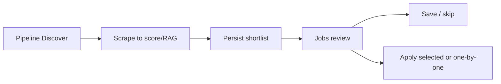

# Job Raider - User Guide

## Quick Start

### Prerequisites

- Python 3.11+
- WSL 2 (Windows) or Linux/macOS
- NVIDIA GPU with 8GB+ VRAM (recommended)
- Ollama installed (for local models)
- Anthropic API key (optional, for fallback)

### Installation

```bash
# Clone the repository
git clone https://github.com/yourusername/job-raider.git
cd job-raider

# Run setup (creates apps/backend-py/.venv, installs Python + Node deps)
./setup.sh

# Pull Ollama models
ollama pull qwen2.5:3b
ollama pull qwen2.5:7b

# Configure backend credentials
cp apps/backend-py/.env.example apps/backend-py/.env
# Edit apps/backend-py/.env — add ANTHROPIC_API_KEY, RAPIDAPI_KEY, API_KEY

# Configure frontend
cp apps/frontend-ts/.env.example apps/frontend-ts/.env.local
# Edit apps/frontend-ts/.env.local — set BACKEND_API_URL and API_KEY (must match backend)
```

### Running Locally

```bash
# Start both services together
make dev

# Or start them individually
make dev-api          # FastAPI backend on :8000
make dev-frontend     # Next.js dashboard on :3000
```

Open http://localhost:3000 in your browser.

## Discover then review on Jobs

Default Pipeline mode is **Discover**: scrape through score/RAG, persist a shortlist, and stop. Apply is never the silent default.



1. On **Pipeline**, leave mode as Discover (recommended). Start the run.
2. When complete, open **Review on Jobs** (or go to Jobs). The feed shows the latest shortlist with a run banner (counts and run id).
3. Review listings, Save, or Apply one-by-one (dry-run by default). No automatic submit after discover.
4. Optional: switch Pipeline to **Full pipeline (advanced)** for detect/generate/submit stages (still defaults to dry-run).

OCR / vision models are not used in this flow — job listings are text scraped from boards.

### Basic Usage

#### Interactive Mode

```bash
cd apps/backend-py
python main.py --interactive
```

This will guide you through:
1. Providing your resume path
2. Entering job keywords
3. Specifying locations
4. Choosing sources
5. Confirming options

#### CLI Mode

```bash
# Basic search with dry run
cd apps/backend-py
python main.py \
  --resume my_resume.pdf \
  --keywords "python engineer" \
  --locations "new york remote" \
  --dry-run

# Full pipeline with submission
cd apps/backend-py
python main.py \
  --resume my_resume.pdf \
  --keywords "fintech AI" \
  --locations "remote" \
  --sources linkedin jsearch \
  --no-dry-run

# Resume from specific stage
cd apps/backend-py
python main.py \
  --resume my_resume.pdf \
  --keywords "SWE" \
  --start-from score_and_rank
```

## Command-Line Options

### Required Arguments

| Option | Description |
|--------|-------------|
| `--resume PATH` | Path to your resume (PDF or DOCX) |
| `--keywords WORDS` | Job keywords to search (space-separated) |
| `--locations LOCS` | Job locations (space-separated) |

### Optional Arguments

#### Search Options

| Option | Description | Default |
|--------|-------------|---------|
| `--sources` | Sources to search | all |
| `--target-keywords` | Additional profile keywords | - |
| `--target-locations` | Additional profile locations | - |
| `--target-experience` | Experience levels | - |

#### Pipeline Options

| Option | Description | Default |
|--------|-------------|---------|
| `--dry-run` | Simulate submissions | true |
| `--no-dry-run` | Enable actual submissions | - |
| `--skip-submission` | Skip submission entirely | false |
| `--start-from STAGE` | Resume from stage | - |
| `--stop-at STAGE` | Stop at stage | - |

#### Scoring Options

| Option | Description | Default |
|--------|-------------|---------|
| `--min-score` | Minimum relevance (0-100) | 60 |
| `--fresh-grad` | Enable fresh graduate scoring mode | false |
| `--scam-threshold` | Scam confidence (0-1) | 0.7 |
| `--max-jobs` | Jobs to present | 20 |

**Fresh Graduate Mode:**
When `--fresh-grad` is enabled, the scoring algorithm adjusts to prioritize projects and education over work experience:

- **Projects (35%)** - Academic projects, portfolio, hackathons
- **Skills (30%)** - Technical skills match against job requirements
- **Education (20%)** - Degree level, major relevance, GPA
- **Experience (10%)** - Internships, part-time work (reduced weight)
- **Location (5%)** - Geographic preferences

The minimum score threshold is also reduced to 50 (from 60) to increase opportunities for entry-level candidates.

#### Submission Options

| Option | Description | Default |
|--------|-------------|---------|
| `--submission-delay` | Delay between submissions (sec) | 2.0 |
| `--max-submissions` | Max submissions per hour | 30 |

#### Storage Options

| Option | Description | Default |
|--------|-------------|---------|
| `--data-dir` | Data storage directory | data |
| `--results-dir` | Results directory | data/results |

#### Logging Options

| Option | Description | Default |
|--------|-------------|---------|
| `--log-level` | Logging level | INFO |
| `--log-file` | Log file path | stdout only |

## Usage Examples

### Example 1: First-Time User

```bash
# Interactive mode for first-time setup
cd apps/backend-py
python main.py --interactive
```

### Example 2: Remote Job Search

```bash
cd apps/backend-py
python main.py \
  --resume ~/Documents/my_resume.pdf \
  --keywords "remote python engineer" \
  --locations "remote united states" \
  --dry-run
```

### Example 3: Target Specific Companies

```bash
cd apps/backend-py
python main.py \
  --resume ~/resume.pdf \
  --keywords "fintech blockchain" \
  --locations "new york san francisco" \
  --sources linkedin \
  --min-score 70
```

### Example 4: High-Volume Application

```bash
cd apps/backend-py
python main.py \
  --resume ~/resume.pdf \
  --keywords "software engineer" \
  --locations "remote" \
  --max-jobs 50 \
  --no-dry-run
```

### Example 5: Resume from Specific Stage

```bash
# Resume from resume generation (skip scraping)
cd apps/backend-py
python main.py \
  --resume ~/resume.pdf \
  --keywords "python" \
  --start-from generate_resumes
```

## Pipeline Stages

### Stage 1: Scrape

Scrapes job listings from configured sources.

```bash
# Specific sources only
cd apps/backend-py
python main.py \
  --resume resume.pdf \
  --keywords "python" \
  --locations "remote" \
  --sources linkedin jsearch
```

### Stage 2: Deduplicate

Removes duplicate listings across sources.

### Stage 3: Filter Scams

Filters out potential scam listings using 10 indicators.

### Stage 4: Filter by Profile

Filters listings matching your profile preferences (keywords, locations, experience levels, and optional `exclude_internships`).

### Stage 5: Score and Rank

Scores listings by relevance (0-100 scale).

```bash
# Adjust minimum score
cd apps/backend-py
python main.py \
  --resume resume.pdf \
  --keywords "python" \
  --locations "remote" \
  --min-score 70
```

### Stage 6: Detect Auto-Submit

Identifies "Easy Apply" opportunities.

### Stage 7: Present Selection

Shows ranked list for selection.

```bash
# Adjust number of jobs presented
cd apps/backend-py
python main.py \
  --resume resume.pdf \
  --keywords "python" \
  --locations "remote" \
  --max-jobs 30
```

### Stage 8: Generate Resumes

Creates tailored resumes for selected jobs.

### Stage 9: Submit Applications

Submits applications (auto-submit where possible).

```bash
# Dry run (default)
cd apps/backend-py
python main.py --resume resume.pdf --keywords "python" --locations "remote"

# Actual submissions
cd apps/backend-py
python main.py --resume resume.pdf --keywords "python" --locations "remote" --no-dry-run

# Skip submission entirely
cd apps/backend-py
python main.py --resume resume.pdf --keywords "python" --locations "remote" --skip-submission
```

## LinkedIn Profile Analysis

The **LinkedIn Analysis** page evaluates your profile for inbound recruiter attraction and recommends improvements. Open it from the sidebar at `LinkedIn Analysis`.

### Input options

The page provides four tabs so you can provide a profile in the way that suits you:

1. **LinkedIn URL** — paste a public LinkedIn profile URL and click **Analyze**. The backend attempts to fetch the page text using the credentials configured in `apps/backend-py/.env` (`LINKEDIN_EMAIL` and `LINKEDIN_PASSWORD`). The fetched content is merged with anything else you supply before the LLM analyzes it.
2. **Search Profiles** — find LinkedIn profiles by keywords, name, title, company, or location. Results appear as selectable cards. Click **Use this profile** on a result to copy its URL into the LinkedIn URL tab and switch to it. Searching requires the same LinkedIn credentials as the URL tab.
3. **Paste Profile Text** — paste the raw text of a LinkedIn profile (or any bio) directly. This works without LinkedIn credentials.
4. **Fill Sections Manually** — enter structured fields such as headline, summary, experience, education, skills, and career goals. This also works without LinkedIn credentials.

### Requirements for URL fetch and people search

URL-based analysis and people search rely on an authenticated LinkedIn session. Set these variables in `apps/backend-py/.env`:

```bash
LINKEDIN_EMAIL=your-linkedin-email@example.com
LINKEDIN_PASSWORD=your-linkedin-password
```

If the credentials are missing or the session cannot start, the URL tab falls back to analyzing only the data you provided, and the Search tab displays a service-unavailable message.

### Interpreting the results

The analysis card shows:

- **Overall score** — a 0–100 recruiter-attraction score.
- **Section scores** — per-section scores and feedback for headline, summary, experience, and so on.
- **Insights** — prioritized recommendations such as keyword gaps, content issues, and profile structure.
- **Action plan** — concrete steps to improve the profile.
- **Generated headline options** and **summary rewrite suggestions** — ready-to-use copy alternatives.

### Programmatic example

You can also call the analysis endpoint directly:

```bash
# Analyze from a LinkedIn URL
curl -s -X POST http://localhost:8000/api/profile/analyze-linkedin \
  -H "Content-Type: application/json" \
  -H "X-API-Key: $API_KEY" \
  -d '{"profile_url": "https://www.linkedin.com/in/janedoe"}' | jq .

# Search for profiles
curl -s -X POST http://localhost:8000/api/profile/search-linkedin \
  -H "Content-Type: application/json" \
  -H "X-API-Key: $API_KEY" \
  -d '{"keywords": "senior python engineer", "limit": 5}' | jq .
```

## Working with Results

### Generated Resumes

Resumes are saved to `data/results/resumes/`:

```
data/results/resumes/
├── {job_id}.pdf
└── {job_id}.docx
```

### Application Tracking

Applications are tracked in `data/results/applications/`:

```bash
# View application status
cat data/results/applications/{app_id}.json
```

### Pipeline Results

Each run saves results to `data/results/pipeline_run_*.json`:

```bash
# View latest run
ls -lt data/results/pipeline_run_*.json | head -1
cat data/results/pipeline_run_TIMESTAMP.json
```

## Multi-Agent API

The multi-agent system exposes career-coaching endpoints under `/api/agents/*`. These are read/write REST endpoints protected by the standard `X-API-Key` header (omitted below for brevity; required when `API_KEY` is set on the backend).

### Check Agent System Status

```bash
# Verify the agent system is initialized and ready
curl -s http://localhost:8000/api/agents/status | jq .
```

A healthy response returns `coordinator_running: true`, `communication_healthy: true`, and one registered agent (`career_coach`, state `ready`). If the system failed to initialize at startup, this endpoint returns HTTP 503.

### Trigger Career Analysis

```bash
# Analyze a user profile against optional target jobs
curl -s -X POST http://localhost:8000/api/agents/career-analysis \
  -H "Content-Type: application/json" \
  -d '{"profile": {"name": "Jane Doe", "skills": ["python", "fastapi"]}, "target_jobs": []}' | jq .
```

### Analyze Skill Gaps

```bash
# Compare a profile against one or more target jobs
curl -s -X POST http://localhost:8000/api/agents/gap-analysis \
  -H "Content-Type: application/json" \
  -d '{"profile": {"skills": ["python"]}, "target_jobs": [{"title": "Senior Backend Engineer"}]}' | jq .
```

Task endpoints (`career-analysis`, `gap-analysis`, `upskilling-roadmap`, `career-goals`) are rate-limited and return a `task_id` for tracking:

```json
{"success": true, "data": {"task_id": "<uuid>", "agent": "career_coach", "task_type": "gap_analysis", "status": "submitted"}}
```

### Other Endpoints

```bash
# Per-agent performance metrics
curl -s http://localhost:8000/api/agents/performance | jq .

# Agent-system health
curl -s http://localhost:8000/api/agents/health | jq .

# Career recommendations
curl -s "http://localhost:8000/api/agents/recommendations?limit=5" | jq .

# Gracefully shut the agent system down
curl -s -X POST http://localhost:8000/api/agents/shutdown | jq .
```

See [Architecture - Multi-Agent Layer](architecture.md#multi-agent-layer) for the component design and request flow.

## Docker Usage

### Starting Services with Docker

The recommended way to run Job Raider is via the Docker startup script:

```bash
# Start all services (auto-detects available ports)
bash docker-run.sh
```

This script:
1. Finds available ports starting from 8000 (API), 11434 (Ollama), and 3000 (frontend)
2. Stops any existing containers
3. Builds images if needed
4. Starts all services in detached mode
5. Displays the assigned ports and access URLs

### Manual Docker Commands

```bash
# Start all services
docker-compose up -d

# View running containers
docker-compose ps

# View logs
docker-compose logs -f

# View logs for a specific service
docker-compose logs -f backend

# Stop all services
docker-compose down

# Rebuild and restart
docker-compose up -d --build
```

### Accessing the API

Once containers are running, the FastAPI interactive documentation is available at:

```bash
# If port 8000 is available
http://localhost:8000/docs

# If port 8000 is taken, the script assigns the next available port
http://localhost:8001/docs
```

Check assigned ports with:

```bash
docker ps --filter "name=job-raider" --format "table {{.Names}}\t{{.Ports}}"
```

### Accessing the Web Dashboard

The Next.js dashboard runs on port 3000:

```bash
http://localhost:3000
```

**Dashboard Features:**

**Theme Toggle:**
- Light/dark mode toggle button at bottom of sidebar
- System theme detection with manual override
- Theme persists across sessions
- Both themes feature the Odysseus design with sharp borders and red accents

**Navigation Pages:**
- **Dashboard** - System health, API costs, recent pipeline runs
- **Pipeline** - Discover (default: scrape and score) or advanced full pipeline; optional Use profile targets
- **Jobs** - Review latest discover shortlist, or live search; optional Use profile targets; apply is explicit
- **Applications** - Track saved and applied jobs (Simulate Apply for dry-run paths)
- **Profile** - Manage profile, skills, experience, and Job Targets (keywords, locations, experience, exclude internships)
- **Assessment** - DISC personality assessment and skill-based technical interview practice
- **Resume Analysis** - AI-powered resume parsing and gap analysis
- **LinkedIn Analysis** - Inbound-attraction scoring and recruiter-focused profile recommendations
- **Cover Letter** - Paste a job description, generate/review, and export
- **Career Coach** - Agent-backed career guidance (requires an active profile)
- **Metrics** - Cost tracking and outcome statistics
- **Settings** - Ollama host, small/large model selection from installed tags, API keys, generation params, cost limits

**DISC Personality Assessment:**
- Industry-standard Most/Least forced-choice format
- 24 questions across 4 categories (Leadership, Communication, Work Style, Problem Solving)
- Job matching recommendations based on your personality profile
- Practice for real job assessments

**Jobs Search Features:**
- Default feed: latest Pipeline discover shortlist (`GET /api/pipeline/shortlist/latest`)
- Location filtering with post-processing to ensure accuracy
- Source selection (LinkedIn, JSearch for 50+ boards)
- Experience level filtering
- Remote-only toggle
- Opt-in **Use profile targets** (default off) to prefill from Profile Job Targets
- Real-time job classification and trust analysis
- Apply and Save are per-job actions (no auto-apply after discover)

**Ollama model choice (Settings):**
- Lists models from the configured Ollama host (including a shared desktop Ollama service)
- Small (fast) and large (quality) tier pickers update task routing
- Recommended defaults remain `qwen2.5:3b` and `qwen2.5:7b`; any installed model may be saved as your default

### Pulling Ollama Models

Models are stored in a persistent Docker volume and pulled on first use. To pre-pull models:

```bash
# Pull models into the Ollama container
docker exec job-raider-ollama ollama pull qwen2.5:3b
docker exec job-raider-ollama ollama pull qwen2.5:7b

# List available models
docker exec job-raider-ollama ollama list
```

### GPU Support

GPU acceleration is automatically available when:
1. An NVIDIA GPU is present on the host
2. The NVIDIA Container Toolkit is installed
3. Docker is configured with the NVIDIA runtime

Verify GPU passthrough:

```bash
docker exec job-raider-ollama nvidia-smi
```

### Docker Troubleshooting

#### Port Already Allocated

If you see `Bind for 0.0.0.0:8000 failed: port is already allocated`:

```bash
# Use docker-run.sh which auto-detects available ports
bash docker-run.sh

# Or manually find what's using the port
lsof -i :8000
docker ps --format "table {{.Names}}\t{{.Ports}}"
```

#### GPU Not Detected in Container

If Ollama logs show CPU-only inference:

```bash
# Check host GPU
nvidia-smi

# Check NVIDIA runtime is registered
docker info | grep -A 3 Runtimes

# Restart Docker Desktop (WSL) to pick up toolkit changes
```

## Best Practices

### 1. Start with Dry Run

Always start with dry-run mode:

```bash
cd apps/backend-py
python main.py --resume resume.pdf --keywords "python" --locations "remote" --dry-run
```

### 2. Adjust Score Threshold

Find the right threshold for your goals:

```bash
# Higher quality, fewer matches
--min-score 80

# Balanced (recommended)
--min-score 60

# More matches, lower quality
--min-score 50
```

### 3. Use Specific Keywords

Better keywords = better matches:

```bash
# Too broad
--keywords "software engineer"

# Better
--keywords "python backend engineer"

# Best
--keywords "python django backend engineer fintech"
```

### 4. Check Scam Detection

Review scam filtering in logs:

```bash
# Run with debug logging
python main.py --resume resume.pdf --keywords "python" --log-level DEBUG
```

### 5. Monitor Submissions

Track submission history:

```bash
# Check application status
ls data/results/applications/
```

## Troubleshooting

### Issue: No jobs found

**Solutions:**
- Try broader keywords
- Add more locations
- Check if sources are accessible
- Lower `--min-score`

### Issue: Too many false positives

**Solutions:**
- Increase `--min-score` (try 70-80)
- Use more specific keywords
- Check scam detection logs

### Issue: Submissions failing

**Solutions:**
- Ensure `--dry-run` is disabled
- Check rate limiting settings
- Verify platform credentials
- Review error logs

### Issue: Ollama models not working

**Solutions:**
```bash
# Check Ollama is running
ollama list

# Pull missing models
ollama pull qwen2.5:3b
ollama pull qwen2.5:7b

# Check GPU support
nvidia-smi

# Check models from backend-py
cd apps/backend-py
python scripts/check_ollama_models.py
```

## Advanced Usage

### Custom Configuration

Edit `apps/backend-py/config/scoring_config.yaml` to customize:

```yaml
# Adjust scoring weights
weights:
  keywords: 30
  skills: 40
  experience: 20
  location: 10

# Set default keywords
default_keywords:
  - python
  - software engineer
  - remote
```

### Programmatic Usage

```python
import sys
sys.path.insert(0, 'apps/backend-py')

from src.pipeline.orchestrator import PipelineOrchestrator, PipelineConfig
from src.models.user_profile import UserProfile
from src.extractors.resume_parser import ResumeParser

# Load profile
parser = ResumeParser()
profile = parser.parse("my_resume.pdf")

# Configure pipeline
config = PipelineConfig(
    keywords=["python", "engineer"],
    locations=["remote"],
    dry_run=True,
)

# Run pipeline
orchestrator = PipelineOrchestrator(config=config, user_profile=profile)
result = orchestrator.run()

print(f"Jobs scraped: {result.jobs_scraped}")
print(f"Jobs applied: {result.jobs_applied}")
```
