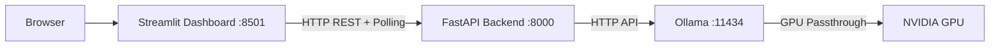
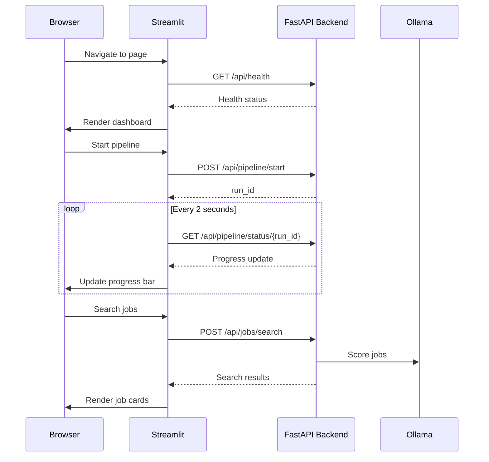

# Job Raider - Streamlit Dashboard

Web dashboard for the Job Raider automated job application pipeline. Provides a visual interface for pipeline management, job browsing, profile management, and metrics monitoring.

## Architecture



## Quick Start

### Local Development

```bash
# From project root
cd frontend-py
source .venv/bin/activate
streamlit run main.py --server.port 8501 --server.headless true
```

The dashboard requires the backend API to be running. Start it separately:

```bash
# In another terminal
cd backend-py
source .venv/bin/activate
python -m uvicorn src.api.main:app --host 0.0.0.0 --port 8000
```

### Docker

```bash
# From project root - starts backend, Ollama, and frontend
bash docker-run.sh
```

## Configuration

Configuration is via environment variables:

| Variable | Default | Description |
|----------|---------|-------------|
| `BACKEND_API_URL` | `http://localhost:8000` | FastAPI backend URL |
| `POLLING_INTERVAL_SEC` | `2` | Pipeline status polling interval |
| `REQUEST_TIMEOUT_SEC` | `30` | Default HTTP request timeout |
| `SEARCH_TIMEOUT_SEC` | `120` | Job search timeout (scraping is slow) |
| `PAGE_SIZE` | `20` | Items per page in listings |
| `DEBUG` | `false` | Enable verbose error messages |

## Pages

### Dashboard
System overview with health status, quick stats (applications, cost, interview rate), recent pipeline runs, and a quick-launch button.

### Pipeline
Start new pipeline runs with configurable parameters (keywords, locations, sources, scoring thresholds). Monitor active runs with live progress. Browse pipeline history with expandable results.

### Jobs
Search jobs across LinkedIn, Indeed, and Glassdoor. Browse results in a card grid. Expand individual jobs to view details, score relevance, and submit applications.

### Profile
Upload resumes (PDF/DOCX) for automatic parsing. View structured profile data (contact info, skills, experience, education). Edit profile fields inline.

### Metrics
Cost dashboard with API vs local model usage breakdown. Application outcome funnel (applied, interviewed, offered). System health grid. Recent LLM call activity table.

## Project Structure

```
frontend-py/
    main.py                  # Streamlit entry point
    requirements.txt         # Python dependencies
    config/
        settings.py          # Environment-based configuration
    src/
        api/
            client.py        # HTTP client for all backend endpoints
        pages/
            dashboard.py     # Home/overview page
            pipeline.py      # Pipeline start, monitor, history
            jobs.py          # Job search and browsing
            profile.py       # Resume upload and profile management
            metrics.py       # Cost, outcome, health dashboards
        components/
            sidebar.py       # Navigation sidebar
            status_badge.py   # Colored status indicators
        utils/
            formatting.py    # Currency, date, duration formatters
            session_state.py  # Streamlit state management
            error_handling.py # Consistent error display
    tests/
        conftest.py          # Test fixtures
        test_api_client.py   # API client tests
        test_formatting.py   # Formatting utility tests
    docker/
        Dockerfile           # Container build config
```

## Running Tests

```bash
cd frontend-py
source .venv/bin/activate
PYTHONPATH=. pytest tests/ -v -o "addopts="
```

## Data Flow


